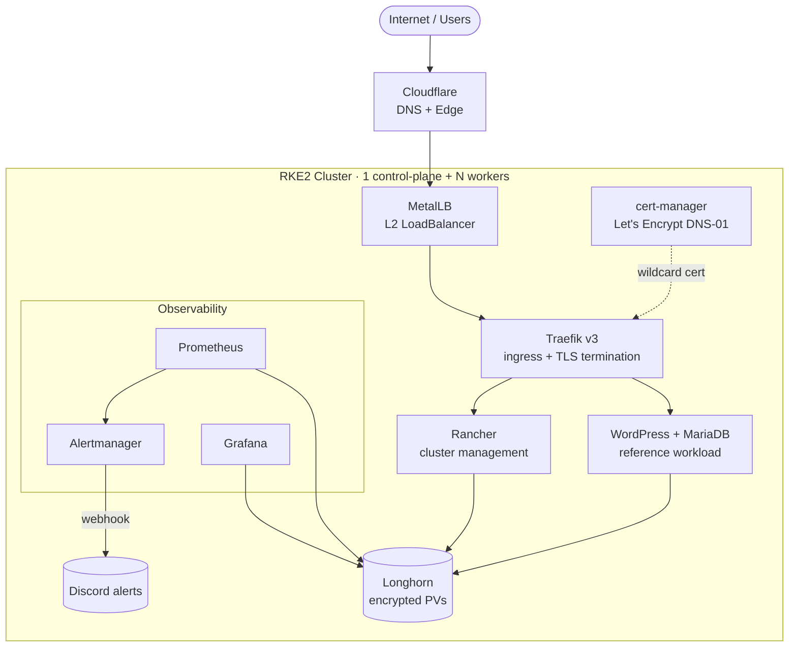

# RKE2 Homelab Kubernetes Blueprint

[](LICENSE)
[](https://github.com/bL34cHig0/rke2-homelab-blueprint/stargazers)
[](https://github.com/bL34cHig0/rke2-homelab-blueprint/issues)


A reproducible blueprint for an RKE2-based Kubernetes cluster on Ubuntu hosts. It covers OS preparation, cluster installation, CIS hardening, networking (MetalLB, NAT egress), ingress with Traefik + cert-manager (Let's Encrypt wildcard), and reference deployments for Rancher, WordPress, and a Prometheus/Grafana monitoring stack. Designed as a hands-on learning vehicle for engineers getting into security, cloud, or platform engineering, and adaptable to production.

This repository is a starting point — every domain, email, namespace and organization identifier appears as a placeholder you must replace before applying any manifest.

## Highlights

- **Security-first by default** — CIS Benchmark hardening, restricted Pod Security, dropped Linux capabilities, read-only root filesystems, and dedicated ServiceAccounts with token automount disabled.
- **Production-grade ingress** — Traefik v3 + cert-manager wildcard TLS via Let's Encrypt DNS-01 (Cloudflare), default security headers, and rate limiting.
- **NetworkPolicy microsegmentation** — per-workload network isolation, plus a NAT-egress and CrowdSec/firewall posture for the host layer.
- **Batteries included** — Rancher (cluster management), Longhorn (encrypted block storage), MetalLB (bare-metal load balancing), and Prometheus/Grafana with Alertmanager → Discord alerting.
- **Real, working manifests** — not skeletons. A hardened WordPress + MariaDB reference workload to model new apps on.
- **Step-by-step docs** — OS prep, RKE2 install, CIS hardening, networking, node maintenance — each decision explained.
- **Cheap to run** — ~€15/month on a 3-node Hetzner cluster; works on any KVM VPS or bare metal.

## Table of Contents

- [Highlights](#highlights)
- [Architecture](#architecture)
- [Background](#background)
- [Placeholder Convention](#placeholder-convention)
- [Layout](#layout)
- [Suggested Order of Operations](#suggested-order-of-operations)
- [Pod Security Baseline](#pod-security-baseline)
- [Suitable Hosting Environments](#suitable-hosting-environments)
- [Scope and Limits](#scope-and-limits)
- [Acknowledgments](#acknowledgments)
- [Contributing](#contributing)

## Architecture

External traffic terminates TLS at **Traefik** (wildcard certificate issued by **cert-manager**) and is routed to workloads on the RKE2 cluster. **MetalLB** provides the bare-metal `LoadBalancer` IP, **Longhorn** backs persistent storage with encryption at rest, and **Prometheus/Alertmanager** handle observability with alerts delivered to Discord.



> Grafana is **not** exposed externally — observability surfaces through Alertmanager → Discord to keep the attack surface minimal. See [`cluster-apps/`](cluster-apps/) for the per-component manifests and [`infrastructure/`](infrastructure/) for the host build.

## Background

This blueprint is the product of roughly 7 months of building and rebuilding Kubernetes clusters from scratch with security as a first-class concern — host hardening, CIS Benchmark conformance, network microsegmentation, image and pod security policy, and the operational habits that surround them. The repo distills those iterations into a coherent starting point others can adopt without repeating every trial-and-error step I went through.

Decisions here reflect specific tradeoffs and learning moments. Not every choice will be optimal for every environment, but each one has a stated reason in the docs — the path forward is to refine them in the open, not to hide them.

If you're getting hands-on with security, cloud, or platform engineering — building toward a homelab that reflects real production patterns, or wanting a starting point you can adapt rather than build from scratch — that's exactly who this is for. The blueprint is production-adaptable: the security choices transfer cleanly to larger clusters (see [Scope and Limits](#scope-and-limits) for what scales as-is and what would need to be swapped), the manifests are real working configs rather than skeleton examples, and the structure is designed so you can lift pieces into a more demanding setup rather than discard the work.

## Placeholder Convention

| Placeholder | Replace with |
|---|---|
| `<your-domain>` | The base domain you control (e.g. `example.com`) |
| `<your-email>` | The email used for Let's Encrypt registration and admin contacts |
| `<your-org>` | Your container registry org / GitHub org (e.g. `acme-corp`) |
| `<your-namespace>` | The Kubernetes namespace for the workload being applied |
| `default-cert-production` / `default-cert-staging` | Names of the cert-manager `Certificate` resources and their TLS secrets |

The blueprint defaults to a **3-level hostname layout** (`<service>.<your-domain>`, e.g. `rancher.example.com`). This is the simplest path: Cloudflare's default edge certificate covers it, and a single Let's Encrypt wildcard for `*.<your-domain>` issued via DNS-01 covers every cluster service.

If you prefer to **group cluster services under a dedicated subdomain** (`<service>.<cluster-subdomain>.<your-domain>`, e.g. `rancher.k8s.example.com`), that's a 4th-level hostname. It's a valid choice — it segments cluster traffic from anything else on the root domain — but it triggers a Cloudflare edge-certificate constraint that has its own opt-in appendix in [cluster-apps/traefik/README.md](cluster-apps/traefik/README.md). Read that section before opting in.

## Layout

```
.
├── infrastructure/                  Cluster build & operations docs
│   ├── rke2-ubuntu-prerequisites.md
│   ├── ubuntu-setup-and-user-provisioning.md
│   ├── ssh-access-to-worker-srv-via-ctrl-plane.md
│   ├── rke2-installation.md
│   ├── rke2-cis-self-assessment-benchmark-config.md
│   ├── metallb-load-balancer-config.md
│   ├── nat-gateway-config.md
│   ├── srv-security-and-firewall-config.md
│   ├── node-maintenance.md
│   ├── uninstalling-or-deactivating-auto-configuration-package.md
│   └── security/
│       └── k8s-deployment-security-policy.md
├── images/                          Screenshots referenced by infrastructure guides
└── cluster-apps/                    Helm values + Kubernetes manifests
    ├── traefik/                     Ingress + cert-manager (Let's Encrypt DNS-01)
    ├── rancher/                     Cluster management UI
    ├── longhorn/                    Distributed block storage (encrypted StorageClass)
    ├── prometheus-grafana/          kube-prometheus-stack values, alert rules
    └── wordpress/                   Reference workload (WP + MariaDB)
```

## Suggested Order of Operations

1. **Host preparation** — `infrastructure/rke2-ubuntu-prerequisites.md`, `infrastructure/ubuntu-setup-and-user-provisioning.md`, `infrastructure/ssh-access-to-worker-srv-via-ctrl-plane.md`
2. **Networking** — `infrastructure/nat-gateway-config.md`, `infrastructure/srv-security-and-firewall-config.md`
3. **Cluster install** — `infrastructure/rke2-installation.md`
4. **CIS hardening (optional)** — `infrastructure/rke2-cis-self-assessment-benchmark-config.md` (enable RKE2's `profile: cis` mode; works on a new or existing cluster)
5. **Load balancer** — `infrastructure/metallb-load-balancer-config.md`
6. **Ingress + TLS** — `cluster-apps/traefik/` (cert-manager, then Traefik, then dashboard)
7. **Cluster management** — `cluster-apps/rancher/`
8. **Storage** — `cluster-apps/longhorn/` (install via the Rancher UI; provides the StorageClasses the next apps' PVCs bind to)
9. **Observability** — `cluster-apps/prometheus-grafana/`
10. **Application workload** — `cluster-apps/wordpress/` (reference pattern for new apps)
11. **Operations** — `infrastructure/node-maintenance.md`, `infrastructure/uninstalling-or-deactivating-auto-configuration-package.md`

## Pod Security Baseline

[`infrastructure/security/k8s-deployment-security-policy.md`](infrastructure/security/k8s-deployment-security-policy.md) collects the workload hardening practices this blueprint follows by default — non-root UIDs, read-only root filesystems, dropped Linux capabilities, dedicated service accounts with `automountServiceAccountToken: false`, network-policy microsegmentation, image-registry allowlisting, and the rate-limit / `X-Forwarded-For` posture for Cloudflare-fronted traffic.

Treat these as a recommended baseline rather than hard requirements. Each control exists for a stated reason in the doc, so you can make an informed call about which ones fit your threat model, which ones to tune, and which ones to relax. The defaults aim for "production-ready out of the box," but a homelab on a private network will reasonably need fewer controls than an internet-facing production cluster.

## Suitable Hosting Environments

This blueprint is sized for a small RKE2 cluster — typically 1 control-plane + 2 workers, or a single-node cluster for testing. It runs on anything that gives you root-shell Ubuntu LTS VMs (or bare metal) with public IPv4 and the ability to load kernel modules. It's well-suited as a homelab or self-hosted staging environment on any of the following cheap/affordable providers:

- **[Hetzner Cloud](https://www.hetzner.com/cloud)** — best price/performance in this class. A 3-node cluster of CX22 instances (2 vCPU, 4 GB RAM) is roughly €15/month total. EU-based, with US locations available.
- **[Hostinger VPS](https://www.hostinger.com/vps-hosting)** — KVM VPS plans start under $5/month per node. Convenient if you're already using Hostinger for DNS or a managed domain.
- **[Contabo](https://contabo.com/)** — generous RAM/CPU at low prices, EU- and US-based. Watch the network egress caps on cheaper tiers.
- **[OVHcloud](https://www.ovhcloud.com/)** — VPS line for small clusters; Eco / SoYouStart bare-metal for heavier workloads.
- **[Scaleway](https://www.scaleway.com/)** — French cloud, comparable to Hetzner. Their `Stardust` nano instances are useful for low-cost dev nodes.
- **[Vultr](https://www.vultr.com/)** / **[DigitalOcean](https://www.digitalocean.com/)** / **[Linode (Akamai)](https://www.linode.com/)** — slightly pricier than the EU options but easy ramps if you're already on those clouds.
- **[Oracle Cloud — Always Free](https://www.oracle.com/cloud/free/)** — up to 4 Arm Ampere cores + 24 GB RAM free forever, when capacity is available (it's frequently constrained). A full free-tier cluster is doable, with the caveat that scheduling new VMs can be unreliable.
- **Bare-metal / home lab** — any spare Intel NUC, Mini PC, or repurposed desktop running Ubuntu LTS works. RKE2 has modest baseline overhead (~1 GB RAM for kube-system per node); plan for at least 3 GB per node to leave room for workloads.

> **What to avoid:** "container-style" or OpenVZ-based budget VPS plans without true kernel access. RKE2 needs to load kernel modules and run an embedded containerd, so stick to KVM/Xen/Hyper-V VPS, dedicated servers, or bare metal. If you're unsure, look for the provider explicitly advertising "KVM VPS."

For sizing, a minimal viable cluster is ~6 GB RAM total (1 GB per node baseline + headroom for Traefik, cert-manager, Rancher, Prometheus, and your apps). A 3-node Hetzner CX22 cluster comfortably runs everything in this blueprint plus a small reference workload like the WordPress example.

## Scope and Limits

This blueprint targets **small-to-mid Kubernetes clusters** — homelab, learning, self-hosted staging, and small production deployments where a 1–5 node cluster is enough. It is not, as-shipped, an enterprise-tier or large-scale cluster blueprint. The line is fuzzy, but the breakdown below sets honest expectations.

**What transfers to clusters of any size:**

The hardening patterns are workload-level decisions, so they survive the jump to larger clusters cleanly:

- Pod security context, capability drops, read-only root filesystems, dedicated ServiceAccounts with `automountServiceAccountToken: false`
- NetworkPolicy microsegmentation per workload
- The rate-limit and `X-Forwarded-For` posture for Cloudflare-fronted traffic
- The cert-manager + DNS-01 wildcard model
- Traefik with `externalTrafficPolicy: Local`
- The folder-per-app repository structure

**What would need to be swapped out at large scale:**

| Component | Current choice | Large-scale alternative |
|---|---|---|
| Control plane | Single node | 3+ nodes for etcd quorum and HA |
| Load balancer | MetalLB L2 mode | MetalLB BGP, or a hardware LB — L2 funnels all ingress through one node at a time |
| Storage | Longhorn (2 replicas, encrypted) | Rook/Ceph, OpenEBS Mayastor, or external storage for high IOPS or large volume counts |
| Database (reference workload) | Single-replica MariaDB | Galera Cluster or primary/replica replication |
| Metrics | Single-instance Prometheus | Thanos, Cortex, or VictoriaMetrics for long-term storage and horizontal scaling |
| Manifest application | Imperative `kubectl apply` | GitOps (Argo CD, Flux) |
| Policy enforcement | None — patterns applied per-manifest | Kyverno or OPA Gatekeeper enforcing the hardening patterns cluster-wide |
| Backups | Not included | Velero for cluster + PVC backups |
| Logging | Not included | Loki, ELK, or similar |
| Egress NAT | Single ingress node | HA egress or CNI-native (e.g., Cilium) |

**Bottom line:** treat this as a **security baseline + reference patterns** that survive the jump to larger clusters, not as a production blueprint at scale. The hardening choices are the most valuable transferable artifact; the operational substrate — HA control plane, storage tier, observability scaling, GitOps, multi-tenancy — is out of scope for this repo and needs separate decisions for production deployments.

## Acknowledgments

Special thanks to **[TechnoTim](https://www.youtube.com/@technotim)**, whose tutorials laid the original groundwork for this project. The practical Kubernetes, self-hosting, and homelab content freely available on his channel is what made it possible to build this from first principles. This repo stands on that foundation and pushes it further into hardened, opinionated defaults.

## Contributing

Contributions are welcome — hardening fixes, simpler manifests, better defaults, additional reference workloads, security review, or clearer documentation. If you spot something that could be more idiomatic, more secure, or just better explained, open a PR or an issue. The goal is for this to be a living blueprint, not a one-off snapshot — best practices on configuring and managing Kubernetes clusters, workloads, and the supporting infrastructure evolve quickly, and the repo should evolve with them.

See [CONTRIBUTING.md](CONTRIBUTING.md) for workflow and style conventions, and [SECURITY.md](SECURITY.md) for how to report a security issue or an insecure default privately.

Some contributions would be especially valuable:

- **Security-hardened manifests for other prominent cluster apps** — GitOps controllers (Argo CD, Flux), auth providers (Authentik, Keycloak, Dex), secret management (External Secrets Operator, Vault, Sealed Secrets), backups (Velero), networking (Cilium, Istio, Linkerd), observability extensions (Loki, Tempo, Thanos, OpenTelemetry), or popular self-hosted apps (Vaultwarden, Nextcloud, Immich, Home Assistant, GitLab).
- **Infrastructure-as-code automation** — Terraform modules to provision the host layer (VMs, networks, firewalls) and Ansible playbooks to automate OS preparation and RKE2 installation, replacing the currently manual steps documented in the `infrastructure/` guides.

The aim is to grow this into a broader catalog of production-ready, hardened patterns that future operators can adopt without re-deriving the same security choices.

If you find this useful or beneficial in your own homelab, learning journey, or production setup, please consider **starring the repo** and **sharing it** with others who might get value from it. Visibility is what turns a personal project into a community resource.

**Use this for ethical purposes only.** This blueprint is intended for legitimate self-hosting, learning, research, and production deployments you own or are authorized to operate. Don't use it to stand up infrastructure for fraud, abuse, illegal services, or any workload that harms others.
