# Deployment Architecture Overview

[**Traefik**](https://traefik.io/traefik): A cloud native application proxy that simplifies and automate the discovery, routing, and load balancing of microservices. It can be configured as the **Kubernetes Ingress Controller** and **load balancer**, to handle external traffic routing and TLS termination for services running within the cluster.

[**Cert-manager**](https://cert-manager.io/): A powerful and extensible **X.509 certificate** controller that automates the issuance, renewal, and management of TLS certificates for Kubernetes resources.

[**Let’s Encrypt**](https://letsencrypt.org/): serves as the **certificate authority** that provides trusted TLS certificates at no cost.

[**Cloudflare**](https://www.cloudflare.com/): is used to perform DNS-01 challenges, enabling automated validation and issuance of standard and wildcard certificates without exposing services publicly.

## Table of Contents

- [Deployment Architecture Overview](#deployment-architecture-overview)
- [Pre-requisites](#pre-requisites)
- [Configuration Steps](#configuration-steps)
  - [Step 1: Create Traefik Namespace and Install Traefik Helm Repo](#step-1-create-traefik-namespace-and-install-traefik-helm-repo)
    - [1.1 Install Traefik](#11-install-traefik)
    - [1.2 Default Headers and Rate Limit Middleware (Template)](#12-default-headers-and-rate-limit-middleware-template)
    - [1.3 Configure Traefik Dashboard](#13-configure-traefik-dashboard)
  - [Step 2: Install and Configure Cert-manager and Let's Encrypt](#step-2-install-and-configure-cert-manager-and-lets-encrypt)
    - [2.1 Add Cert-manager and CRDs to Helm Repo](#21-add-cert-manager-and-crds-to-helm-repo)
    - [2.2 Verify Cert-manager Installation](#22-verify-cert-manager-installation)
  - [Step 3: Test Cert-manager with Let's Encrypt's Staging API](#step-3-test-cert-manager-with-lets-encrypts-staging-api)
    - [3.1 Generate Cloudflare API Token for DNS01 Challenge Configuration](#31-generate-cloudflare-api-token-for-dns01-challenge-configuration)
    - [3.2 Implement Staging Cluster Issuer and Certificate](#32-implement-staging-cluster-issuer-and-certificate)
  - [Step 4: Configure DNS](#step-4-configure-dns)
    - [4.1 Access and Login to Traefik Dashboard via Hostname](#41-access-and-login-to-traefik-dashboard-via-hostname)
    - [4.2 Verify the Issuer of the Certificate](#42-verify-the-issuer-of-the-certificate)
  - [Step 5: Configure Cert-manager with Let's Encrypt's Production API](#step-5-configure-cert-manager-with-lets-encrypts-production-api)
    - [5.1 Apply the Production Cluster Issuer](#51-apply-the-production-cluster-issuer)
    - [5.2 Access Traefik's Production Dashboard](#52-access-traefiks-production-dashboard)
    - [5.3 Verify the Issuer of the Certificate](#53-verify-the-issuer-of-the-certificate)
- [Production Best Practices and Troubleshooting](#production-best-practices-and-troubleshooting)
  - [Checking Traefik Logs](#checking-traefik-logs)
    - [Common Commands](#common-commands)
    - [Log Format: CLF vs JSON](#log-format-clf-vs-json)
    - [Switching to JSON](#switching-to-json)
  - [Checking and Upgrading Traefik Versions](#checking-and-upgrading-traefik-versions)
    - [Check Available Versions](#check-available-versions)
    - [Parse Release Notes Thoroughly Before Upgrading](#parse-release-notes-thoroughly-before-upgrading)
    - [Pin the New Version](#pin-the-new-version)
    - [Preview the Diff](#preview-the-diff)
    - [Upgrade with Helm](#upgrade-with-helm)
    - [Verify the Upgrade](#verify-the-upgrade)
    - [Chart `appVersion` vs Running `image.tag`](#chart-appversion-vs-running-imagetag)
    - [Rollback](#rollback)
- [Appendix — Nested Cluster Subdomains and the Cloudflare Edge-Cert Pitfall](#appendix--nested-cluster-subdomains-and-the-cloudflare-edge-cert-pitfall)
  - [Symptom](#symptom)
  - [Root Cause](#root-cause)
  - [Setup Context](#setup-context)
  - [Solutions](#solutions)
    - [Option 1 — Stay on the 3-Level Default (Recommended for Most)](#option-1--stay-on-the-3-level-default-recommended-for-most)
    - [Option 2 — Disable Proxy for Affected Records (Quickest Patch)](#option-2--disable-proxy-for-affected-records-quickest-patch)
    - [Option 3 — Upload a Custom Edge Certificate to Cloudflare](#option-3--upload-a-custom-edge-certificate-to-cloudflare)
    - [Option 4 — Flatten with a Hyphen Instead of a Dot](#option-4--flatten-with-a-hyphen-instead-of-a-dot)
    - [Option 5 — Cloudflare Enterprise](#option-5--cloudflare-enterprise)
  - [Verification](#verification)
  - [Summary](#summary)
- [Other Docs](#other-docs)

---

## Pre-requisites

- RKE2 server and agent services installed on the control plane(s) and worker node(s).
- **ingress-nginx-controller** disabled to prevent resource conflicts, configuration issues, and unpredictable behavior. See [rke2-installation](rke2-installation.md). Addtionally, [ingress-nginx-controller](https://kubernetes.io/blog/2025/11/11/ingress-nginx-retirement/) has reached it's end of life support. 
- Helm package manager (**CLI**) for Traefik installation.
- A designated ingress node with a **public** and **private** IP.
- MetalLb software installed on the designated ingress node. Refer to the [metall-load-balancer-config](metall-load-balancer-config.md) documentation for installation instructions if it is not already installed.
- A Cloudflare account to procure API keys from.

**Note**: Traefik was installed on the control plane at the time of documenting this, because it was the designated ingress node.

## Configuration Steps

Login with the service account on the control plane or designated ingress node via `ssh`. Switch to the root user - `sudo -i`.

Download the repo on the control plane and navigate to `traefik` directory to deploy `traefik`. Use `git clone` or the `Download Zip` button to download the repo.

**Caveat**: Some manifest files (configurations) are installed in `traefik` namespace while others are installed in `cert-manager` namespace. Before generating credentials with `CLI` tools, ensure credentials are not being logged in `history` by adding the following commands to `~/.bashrc`, if not already there. Add it below the settings for history length line.

Finally, generate strong, unique passwords with a password manager. Avoid generating passwords with **special characters** and **punctuations** to prevent them from breaking the installation. Use alphanumeric passwords (>= 18) and store them securely in a password manager.

```
# use nano to open the root user's bashrc file
nano .bashrc

# add the following configuration to prevent CLI tools for generating credentials from being logged in history
# display history commands timestamp
export HISTTIMEFORMAT="%F %T "

# ignore sensitive commands
export HISTIGNORE="echo*:*password*:*secret*:*token*:*htpasswd*:*base64*:openssl*"

# source bashrc file to load the configuration
source .bashrc
```

### Step 1: Create Traefik Namespace and Install Traefik Helm Repo

Change into the `traefik` directory after pulling the repo locally:

```
cd rke2-homelab-blueprint/cluster-apps/traefik
```

Create traefik namespace:

```
kubectl create namespace traefik
```

Verify it by getting all namespaces:

```
kubectl get namespaces
```

<p align="center">
    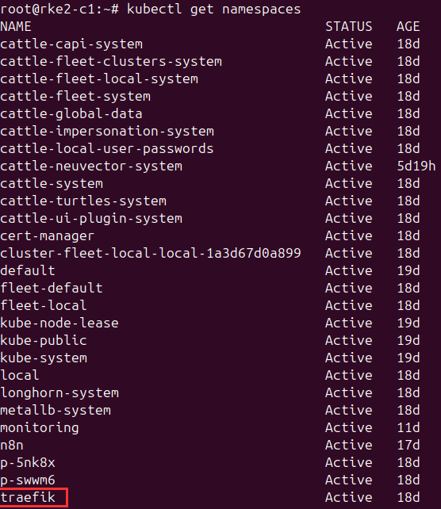
</p>

Verify helm installation:

```
helm version
```

Add traefik helm repo:

```
helm repo add traefik https://helm.traefik.io/traefik
```

Update the repo:

```
helm repo update
```

**Note**: By default, [helm](https://helm.sh/docs/intro/install/) package manager is pre-installed with `RKE2`. However, if it's not installed, use the following command to install it:

```
curl -fsSL -o get_helm.sh https://raw.githubusercontent.com/helm/helm/main/scripts/get-helm-3
chmod 700 get_helm.sh
./get_helm.sh
```

#### 1.1 Install Traefik

Replace the **designated-ingress-node-public-ip** placeholder inside **values.yaml**, with the designated ingress node public IP:

```
# use nano to edit the file
nano values.yaml

# save file after updating it
Ctrl + X, then Y, then Enter
```

Install traefik in **traefik** namespace with the custom **values.yaml** manifest file inside traefik directory:

```
helm install --namespace=traefik traefik traefik/traefik --values=values.yaml
```

**Note**: Use `helm upgrade --namespace=traefik traefik traefik/traefik --values=values.yaml` to apply updates made to the custom `values.yaml`.

Verify the status of the traefik ingress controller service:

```
# view services in all namespaces
kubectl get svc --all-namespaces -o wide

# to narrow down the output to traefik service
kubectl get svc -n traefik -o wide

# to verify the image tag
kubectl get pods -n traefik -o jsonpath="{.items[*].spec.containers[*].image}"
```

<p align="center">
    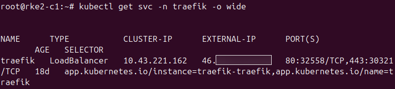
</p>

**Note**: Ensure the public IP of the designated ingress node is visible in the **EXTERNAL-IP** field. In this case, it is the control plane's public IP.

Verify all pods are in **Running** status:

```
kubectl get pods -n traefik
```

<p align="center">
    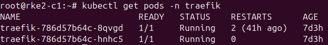
</p>

#### 1.2 Default Headers and Rate Limit Middleware (Template)

`default-headers.yaml` in this directory is a **reference template**, not a manifest to apply directly. It defines two Middlewares — a security-headers Middleware (`default-headers`) and a per-source-IP rate limit (`ratelimit`) — that every workload typically needs. Don't apply this file: Traefik Middlewares are namespace-scoped, and an `IngressRoute` can only reference Middlewares in the same namespace by bare name. Applying this file as-is would leave the Middlewares orphaned in `<your-namespace>` (or fail outright on the placeholder).

Instead, **copy this file into each workload's directory**, set `namespace:` to that workload's namespace, tune `average`/`burst` for the expected traffic profile, and add or remove headers as needed. The repo already follows this pattern:

- [cluster-apps/wordpress/default-headers.yaml](../wordpress/default-headers.yaml) — wordpress copy (`average: 75`, `burst: 150`, also strips the `Server` response header)
- [cluster-apps/rancher/default-headers.yaml](../rancher/default-headers.yaml) — rancher copy (`average: 50`, `burst: 100`)

When you adapt this template for a new workload, the consuming `IngressRoute` references both Middlewares by bare name (`name: default-headers`, `name: ratelimit`) and Traefik resolves them in the IngressRoute's namespace.

<p align="center">
    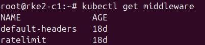
</p>

#### 1.3 Configure Traefik Dashboard

Install `htpasswd` to generate base64 encoded credentials and change into the **dashboard** directory:

```
apt-get update
apt-get install apache2-utils
cd dashboard
```

> The `secret-dashboard.yaml` file in this directory is a **template** showing the Secret's shape. Don't edit it with real values or apply it directly — create the Secret imperatively so credentials never touch the repo. `kubectl create secret` base64-encodes the value for you, so no manual `openssl base64` step is needed.

Generate the htpasswd credential:

```
htpasswd -nbB <username> <strong-password>
```

**Note**: Use a strong password (>= 18 characters) and store it securely in a password manager.

Create the Secret, passing the full htpasswd output (e.g. `admin:$2y$05$...`) as the `users` value:

```
kubectl create secret generic traefik-dashboard-auth -n traefik \
  --from-literal=users='<htpasswd-output>'
```

Verify the secret:

```
kubectl get secrets -n traefik
```

Apply traefik dashboard middleware:

```
kubectl apply -f middleware.yaml
```

Apply traefik dashboard ingress route:

```
kubectl apply -f ingress.yaml
```

**Note**: Cert-manager and Let's encrypt needs to be configured to be able to access the dashboard publicly via the `hostname` specified in the ingress route manifest (**ingress.yaml**).

Verify the ingress route and middleware:

```
kubectl get ingressroute -n traefik
kubectl get middleware -n traefik
```

<p align="center">
    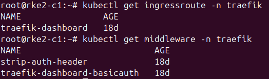
</p>

### Step 2: Install and Configure Cert-manager and Let's Encrypt

Change into `cert-manager` directory and create **cert-manager** namespace:

```
# change to cert-manager directory
cd cert-manager

# create cert-manager namespace
kubectl create namespace cert-manager
```

#### 2.1 Add Cert-manager and CRDs to Helm Repo

Add cert-manager helm chart and update the repo:

```
helm repo add jetstack https://charts.jetstack.io
helm repo update
```

Verify cert-manager namespace:

```
kubectl get namespaces
```

Apply cert-manager custom resource definition (CRD):

```
# cert-manager crd command
kubectl apply -f https://github.com/cert-manager/cert-manager/releases/download/<latest-release-tag>/cert-manager.crds.yaml

# ex: v1.19.2 installation
kubectl apply -f https://github.com/cert-manager/cert-manager/releases/download/v1.19.2/cert-manager.crds.yaml
```

**Note**: Check out cert-manager [releases note](https://github.com/cert-manager/cert-manager/releases) for the latest version and update the version number in the url with the latest one. **v1.19.2** was the latest at the time of documenting this.

Install cert-manager with helm:

```
# helm command
helm install cert-manager jetstack/cert-manager --namespace cert-manager --values=values.yaml --version <crd-version>

# ex: v1.19.2 installation
helm install cert-manager jetstack/cert-manager --namespace cert-manager --values=values.yaml --version v1.9.2
```

**Note**: The version specified with the `--version` switch must match the same version number of the cert-manager CRD installed. Additionally, ensure you're in the **cert-manager** directory because it contains the `values.yaml` needed to be installed.

#### 2.2 Verify Cert-manager Installation

Ensure all pods are in **Running** status:

```
kubectl get pods -n cert-manager
```

<p align="center">
    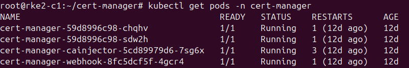
</p>

Ensure cert-manager services are deployed:

```
kubectl get svc -n cert-manager
```

<p align="center">
    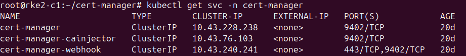
</p>

### Step 3: Test Cert-manager with Let's Encrypt's Staging API

Test **cert-manager** with **Let’s Encrypt’s staging API** before switching to the production API. It allows you to validate your entire certificate issuance workflow—**DNS challenges**, **HTTP-01 routing**, **RBAC permissions**, **ingress configuration**, and **renewal logic**—without risking rate limits or account lockouts.

Let's Encrypt's staging API has much higher rate limits and is designed for safe iteration, to enable teams to catch misconfigurations early.

#### 3.1 Generate Cloudflare API Token for DNS01 Challenge Configuration

Login to Cloudflare and follow the settings in the screenshot to generate an API token for **DNS01 challenge** configuration:

<p align="center">
    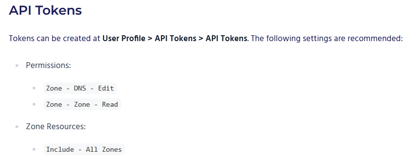
</p>

**Note**: Ensure to adhere to the settings stipulated when generating the API token. See cert-manager [docs](https://cert-manager.io/docs/configuration/acme/dns01/cloudflare/#api-tokens) and cert-manager supports other [DNS01 providers](https://cert-manager.io/docs/configuration/acme/dns01/#supported-dns01-providers), however, Cloudflare is the provider in this case.

> The `secret-cf-token.yaml` file in `cert-manager/issuers/` is a **template** showing the Secret's shape. Don't edit it with the real token or apply it directly — create the Secret imperatively so the token never touches the repo.

Create the Secret with the API token you just generated:

```
kubectl create secret generic cloudflare-token-secret -n cert-manager \
  --from-literal=cloudflare-token='<your-cloudflare-api-token>'
```

**Note**: The secret must be created in the **cert-manager** namespace. The `letsencrypt-staging` and `letsencrypt-production` `ClusterIssuer`s reference it via `apiTokenSecretRef`, and cert-manager resolves that reference in its own namespace. The secret name (`cloudflare-token-secret`) and key (`cloudflare-token`) must match the values in the issuer manifests.

Verify the secret:

```
kubectl get secret cloudflare-token-secret -n cert-manager -o yaml
```

#### 3.2 Implement Staging Cluster Issuer and Certificate

Change into the **issuers** directory, if not in it and apply the staging cluster issuer `letsencrypt-staging.yaml`:

```
# switch to the staging directory in the issuers directory
cd issuers/staging or cd ~/rke2-homelab-blueprint/cluster-apps/traefik/cert-manager/issuers/staging

# apply the manifest
kubectl apply -f letsencrypt-staging.yaml

# verify the cluster issuer
kubectl get clusterissuer 
```

> **Note on naming:** The `default-cert-staging` and `default-cert-production` names used for the cert-manager `Certificate` resources, their TLS secrets (`default-cert-staging-tls` / `default-cert-production-tls`), and the manifest file names are a **convention, not a requirement**. Rename them to whatever fits your environment — e.g. `cluster-tls-staging`, `acme-com-wildcard`, `tls-prod`, etc. If you rename them, update the references in the rancher, wordpress, and traefik-dashboard ingress manifests so the `secretName` matches the renamed Secret. The root [README.md](../../README.md) placeholder table tracks these as cluster-wide defaults.

Apply the staging certificate `default-cert-staging.yaml`:

```
# switch to the staging directory in the certificates directory
cd ../certificates/staging or cd ~/rke2-homelab-blueprint/cluster-apps/traefik/cert-manager/certificates/staging

# apply the staging certificate manifest
kubectl apply -f default-cert-staging.yaml

# verify the certificate
kubectl get certificate -n traefik
```

Tail the logs for each cert-manager pod to verify if cert-manager is propagating the DNS name:

```
kubectl logs -n cert-manager -f <cert-manager-pod-name>
```

If the following logs is outputted, it means that it's creating a **TXT** record in Cloudflare, and if the **CA** (Let's Encrypt) can see that record, it considers the domain verified and issues the certificate.

<p align="center">
    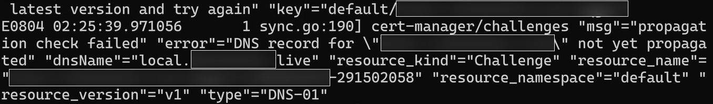
</p>

In a nutshell, this is what unfolds:

- When you request a certificate for a domain, the **CA** (Let's Encrypt) asks you to create a **TXT** record.

- Cert-manager creates this TXT record via your DNS provider’s API (Cloudflare).

- Let’s Encrypt queries public DNS resolvers to verify the TXT record exists.

- If the record matches, the CA issues the certificate and cert-manager cleans up the TXT record afterwards.

**Note**: This could take 3-5 minutes to be done. You'd know it's done when it stops populating the error.

Apply the staging ingress route for traefik:

```
# switch to traefik dashboard directory
cd ~/rke2-homelab-blueprint/cluster-apps/traefik/dashboard

# apply staging-ingress.yaml
kubectl apply -f staging-ingress.yaml

# verify the staging ingress route
kubectl get ingressroute -n traefik
```

### Step 4: Configure DNS

Navigate to Cloudflare or your DNS provider.

Point an `A` record at the designated ingress node's public IP with the name set to the domain name specified in `ingress.yaml` for Traefik's dashboard (for example, `traefik.example.com`). If you already have a wildcard record (e.g. `*.example.com`) covering that hostname, no additional record is needed — the wildcard suffices.

**Note**: wildcards match exactly one label and do **not** cover the apex domain or deeper subdomains. For example, `*.example.com` covers `traefik.example.com` but neither `example.com` nor `traefik.apps.example.com` — those need their own records.

#### 4.1 Access and Login to Traefik Dashboard via Hostname

Open up a web browser and enter the hostname/domain name. In this case, that would be `traefik.<your-domain>`. You should be prompted to enter the **username** and **password**.

Enter the username and password generated in [1.3 Configure Traefik Dashboard](#13-configure-traefik-dashboard) and access should be successful.

<p align="center">
    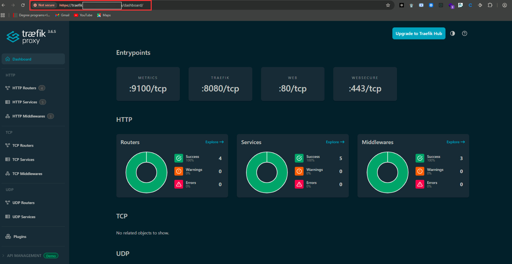
</p>

**Note**: If a "**Your connection is not private**" warning pops up on your web browser after accessing `traefik.<your-domain>`, click **Advanced > Proceed** to be directed to the dashboard.

#### 4.2 Verify the Issuer of the Certificate

The **URL** should have a **Not Secure** icon on your web browser. This is because Let's Encrypt's staging API (CA) is used to sign the certificate. 

Verify the issuer by click on the **Not Secure** icon beside the **URL**. Then click **view certificate** to view the cerficate information.

You should see "**(STAGING) Let's Encrypt**" in the "**Issued By**" section.

<p align="center">
    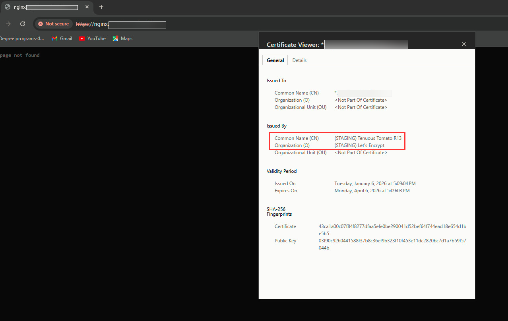
</p>

This means that the configuration works and can now proceed to use Let's Encrypt's production API to sign valid certificates.

### Step 5: Configure Cert-manager with Let's Encrypt's Production API

Once the configuration for Let's Encrypt's staging API works, the production API can now to used to sign valid certificates. 

To do so, use the production issuer and certificate.

#### 5.1 Apply the Production Cluster Issuer

Apply the production issuer:

```
# switch to the production directory in the issuers directory
cd ~/rke2-homelab-blueprint/cluster-apps/traefik/cert-manager/issuers/production

# apply the production issuer manifest
kubectl apply -f letsencrypt-production.yaml
```

Apply the production certificate:

```
# switch to the production directory in the certificates directory
cd ~/rke2-homelab-blueprint/cluster-apps/traefik/cert-manager/certificates/production

# apply the production certificate manifest
kubectl apply -f default-cert-production.yaml
```

Verify the production issuer and certificate:

```
kubectl get clusterissuer
kubectl get certificate -n traefik
```

<p align="center">
    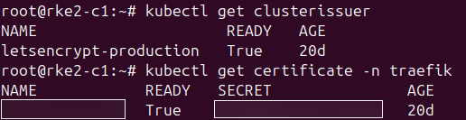
</p>

Verify that the production ingress route for traefik dashboard has been applied:

```
kubectl get ingressroute -n traefik
```

<p align="center">
    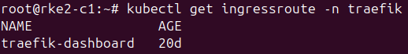
</p>

Note: Refer to [1.3 Configure Traefik Dashboard](#13-configure-traefik-dashboard) on how to apply the ingress route for traefik's production dashboard, if you haven't.

Delete the staging issuer, certificate, and ingress route:

```
# verify that the staging issuer still exists
kubectl get clusterissuer

# delete the staging issuer
kubectl delete clusterissuer letsencrypt-staging.yaml

# verify that the staging certificate still exists
kubectl get certificate -n traefik

# delete the staging certificate
kubectl delete certificate default-cert-staging.yaml -n traefik

# verify that the staging ingress route still exists
kubectl get ingressroute -n traefik

# delete the staging ingress route
kubectl delete ingressroute staging-ingress.yaml -n traefik
```

#### 5.2 Access Traefik's Production Dashboard

On your web browser, enter the same hostname/domain name, `traefik.<your-domain>`. You should be directed to the dashboard without a "**Your connection is not private**" warning.

Enter the credentials when prompted and access should be successful.

<p align="center">
    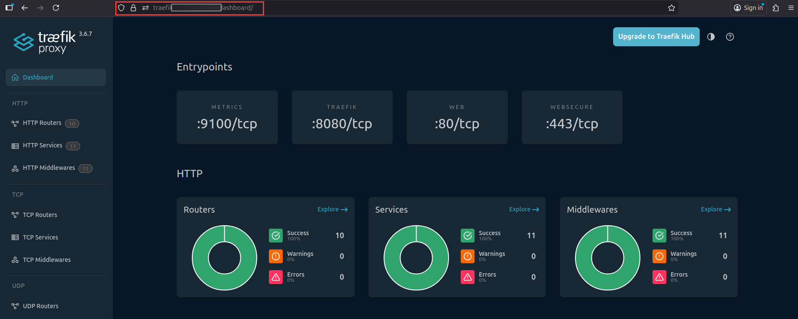
</p>

**Note**: It might take a few minutes or in some cases, hours, for the certificate and connection to be secure. So it is advisable to access the hostname in a private window or different browser.

#### 5.3 Verify the Issuer of the Certificate

The **URL** should not have a **Not Secure** icon on your web browser.

Click on the **icon beside the url > connection is secure > certificate is valid** to verify the certificate issuer. You should see "**Let's Encrypt**" in the "**Issued By**" section.

<p align="center">
    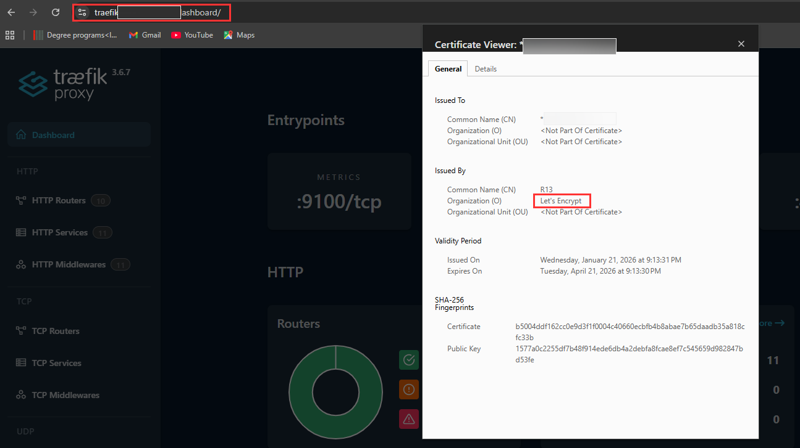
</p>

## Production Best Practices and Troubleshooting

### Checking Traefik Logs

Traefik writes two log streams to the pod's stdout, both visible via `kubectl logs`:

| Stream | What it contains | Controlled by |
|---|---|---|
| **App log** | Startup output, router/middleware/provider events, errors, warnings | `--log.level=INFO` (set in `values.yaml` under `additionalArguments`), `--log.format=` |
| **Access log** | One line per HTTP request (client IP, host, path, status, duration, router, service) | `logs.access.enabled: true` (set in `values.yaml`), `logs.access.format=` |

#### Common Commands

```bash
# tail the latest N lines from all Traefik pods (label selector survives pod restarts)
kubectl logs -n traefik -l app.kubernetes.io/name=traefik --tail=30

# follow live across all replicas
kubectl logs -n traefik -l app.kubernetes.io/name=traefik -f

# follow a single named pod (useful when one replica misbehaves)
kubectl logs -n traefik <traefik-pod-name> -f

# previous container — for restart loops
kubectl logs -n traefik -l app.kubernetes.io/name=traefik --previous

# limit to a time window
kubectl logs -n traefik -l app.kubernetes.io/name=traefik --since=15m

# filter access logs by downstream namespace (works because router/service names include the namespace)
kubectl logs -n traefik -l app.kubernetes.io/name=traefik --tail=200 | grep "wordpress"

# grep only access-log lines (skip startup/router events)
kubectl logs -n traefik -l app.kubernetes.io/name=traefik --tail=200 \
  | grep -E '^[0-9]+\.[0-9]+\.[0-9]+\.[0-9]+'
```

For multi-pod live tailing, the [`stern`](https://github.com/stern/stern) Krew plugin is convenient:

```bash
kubectl stern -n traefik traefik
```

#### Log Format: CLF vs JSON

Traefik supports two formats — `common` (CLF, the default) and `json` — for both streams.

| | CLF (`common`) | JSON (`json`) |
|---|---|---|
| Readable directly in `kubectl logs` | Compact, easy to skim | Noisy single-line objects |
| Ad-hoc grep | Predictable column order | Works with `jq` |
| Structured fields (status, duration, client IP, router, service) | Fixed columns only | Every field keyed |
| Loki / Promtail / ELK / Splunk ingestion | Needs regex parsers | Native, fields auto-indexed |
| Volume on disk | Smaller | ~30-50% larger |
| Alerting and dashboards | Limited | Query by status, latency, router, etc. |

**Recommendation: use `json` for production.** This cluster already runs the kube-prometheus-stack (see [prometheus-grafana](../prometheus-grafana/)), and adding Loki — the standard companion — makes JSON access logs directly queryable in Grafana without any parser config:

```logql
{namespace="traefik"} | json | DownstreamStatus >= 500
{namespace="traefik"} | json | Duration > 1s
{namespace="traefik"} | json | RouterName =~ "wordpress.*"
```

CLF is fine for the current `kubectl logs | grep` workflow, but every stat worth charting later (latency p99 per router, 4xx vs 5xx by service, top client IPs) becomes far easier when fields are already keyed.

#### Switching to JSON

Update [values.yaml](values.yaml):

```yaml
logs:
  general:
    format: json    # Traefik's own startup/router logs
  access:
    enabled: true
    format: json    # per-request access logs
```

Apply with Helm:

```bash
helm upgrade --namespace=traefik traefik traefik/traefik --values=values.yaml
```

A sample one-line JSON access record looks like:

```json
{"ClientHost":"203.0.113.42","RequestMethod":"POST","RequestPath":"/wp-login.php","DownstreamStatus":429,"Duration":1873000,"RouterName":"wordpress@kubernetescrd","ServiceName":"wordpress-wordpress-80@kubernetescrd","time":"2026-04-26T10:14:22Z"}
```

For one-off human-readable inspection of JSON logs:

```bash
# pretty-print and filter for 5xx responses
kubectl logs -n traefik -l app.kubernetes.io/name=traefik --tail=200 \
  | jq 'select(.DownstreamStatus >= 500)'

# show only path, status, and duration
kubectl logs -n traefik -l app.kubernetes.io/name=traefik --tail=200 \
  | jq '{RequestPath, DownstreamStatus, Duration}'
```

---

### Checking and Upgrading Traefik Versions

Since the in-log version notification is intentionally disabled (`--global.checknewversion=false` in [values.yaml](values.yaml#L13)), version tracking has to happen out-of-band. There are two version streams to keep in sync:

| Stream | What it controls | Where it's set |
|---|---|---|
| **Helm chart version** | Chart templates, default values, and the CRDs bundled with that chart release | `--version` on `helm install` / `helm upgrade` |
| **Traefik image tag** | The Traefik binary that runs in the pods | `image.tag` in [values.yaml](values.yaml#L8) |

The chart and the image are versioned independently — a chart release recommends a specific Traefik binary, but `image.tag` can override it. Keep both current and aligned.

#### Check Available Versions

```bash
# refresh the local repo cache first
helm repo update

# list the latest published chart versions (newest first)
helm search repo traefik/traefik --versions | head -n 10

# show only the most recent chart version
helm search repo traefik/traefik
```

For the upstream Traefik **binary** (image tag), watch the GitHub release feeds — they hold the breaking-change notes:

- [Traefik releases](https://github.com/traefik/traefik/releases) — for the binary (`image.tag`).
- [Traefik Helm chart releases](https://github.com/traefik/traefik-helm-chart/releases) — for the chart version.

#### Parse Release Notes Thoroughly Before Upgrading

**Read every release note from the currently installed version up to the target — not just the latest.** A multi-version jump compounds every intervening release's breaking changes, and a "minor" bump is sometimes only minor on the binary side while the chart bundles a CRD revision or default change. Skipping a single 3.x release has, historically, broken production setups.

Flag these specifically when reading the notes:

- **CRD schema changes.** New, removed, or renamed fields on `IngressRoute`, `Middleware`, `TLSStore`, `TLSOption`, `ServersTransport`, etc. Existing CRD instances may need to be updated to match. Helm does **not** upgrade CRDs on `helm upgrade` — they have to be applied manually.
- **Default behavior changes.** Examples that have bitten this deployment in the past or could in future: `sourceCriterion.requestHost` default flipped between v2 and v3 (see [traefik-rate-limit-troubleshooting.md](traefik-rate-limit-troubleshooting.md)); RFC 3986 encoded-character defaults in v3.x (currently set explicitly in [values.yaml](values.yaml#L18-L24)).
- **Removed or renamed config fields.** A flag you rely on in `additionalArguments` may have moved or been retired. Renamed keys typically log a deprecation warning one version before removal — never ignore them.
- **Provider behavior.** Kubernetes provider changes, label-selector semantics, IngressClass enforcement, ACME workflow changes.
- **Middleware behavior.** Anything used in [default-headers.yaml](default-headers.yaml) (security headers, rate limit) and per-app middlewares. Rate-limit semantics in v3 are particularly sensitive — see the troubleshooting doc.
- **Deprecations.** A v3.x release may deprecate something that gets removed in the very next minor. Address deprecations during the current upgrade to avoid the next one being a cliff.

If anything in the notes is ambiguous, test the upgrade in a non-production cluster first. There is no fast rollback for a CRD migration that has already been applied.

#### Pin the New Version

Once you've decided on a target chart version (e.g. `<chart-version>`) and image tag (e.g. `<binary-tag>`):

1. Update [values.yaml](values.yaml) — set `image.tag` to the new binary version. Commit the change to the repo so it survives.
2. Apply any **new CRDs** the target chart version ships:

```bash
# pull the chart at the target version into a scratch directory
helm pull traefik/traefik --version <chart-version> --untar --untardir /tmp/traefik-chart

# apply the CRDs bundled with that chart version
kubectl apply -f /tmp/traefik-chart/traefik/crds/

# verify
kubectl get crd | grep traefik.io
```

Some chart releases ship CRDs as a separate URL referenced in the release notes — follow the exact instruction there if it differs. Always apply CRDs **before** the helm upgrade.

#### Preview the Diff

Verify what will actually change before applying. The `helm-diff` plugin is the easiest way:

```bash
# install once: helm plugin install https://github.com/databus23/helm-diff

helm diff upgrade traefik traefik/traefik \
  --namespace=traefik \
  --version=<chart-version> \
  --values=values.yaml
```

If `helm-diff` is not available, compare rendered manifests manually:

```bash
helm template traefik traefik/traefik --version=<chart-version> --values=values.yaml > /tmp/new.yaml
helm get manifest traefik -n traefik > /tmp/current.yaml
diff /tmp/current.yaml /tmp/new.yaml
```

#### Upgrade with Helm

```bash
helm upgrade traefik traefik/traefik \
  --namespace=traefik \
  --version=<chart-version> \
  --values=values.yaml
```

Watch the rollout — the deployment uses `RollingUpdate`, so pods are replaced one at a time:

```bash
kubectl rollout status deployment/traefik -n traefik --timeout=5m
kubectl get pods -n traefik -l app.kubernetes.io/name=traefik -o wide
```

> Note: With `externalTrafficPolicy: Local` (this deployment's setup — see [traefik-rate-limit-troubleshooting.md](traefik-rate-limit-troubleshooting.md)), each node must continue to host one Traefik pod throughout the rollout. The chart's `topologySpreadConstraints: DoNotSchedule` and `replicas: 4` configuration already enforces this, but if a rollout stalls, check that `kubectl get pods -o wide` shows pods spread across all nodes.

#### Verify the Upgrade

```bash
# confirm the new image tag is running
kubectl get pods -n traefik -o jsonpath="{.items[*].spec.containers[*].image}"

# tail the startup logs — confirm the new version banner and clean provider start
kubectl logs -n traefik -l app.kubernetes.io/name=traefik --tail=50

# confirm the helm release is on the new version
helm list -n traefik

# end-to-end traffic check (use any production hostname)
curl -sS -o /dev/null -w "%{http_code}\n" https://traefik.<your-domain>
curl -sS -o /dev/null -w "%{http_code}\n" https://<another-app-host>

# verify CRD-managed objects still resolve
kubectl get ingressroute -A
kubectl get middleware -A
kubectl get certificate -A
```

Watch the Grafana dashboard / `kubectl logs` for at least 10–15 minutes after the upgrade to catch latent issues (auth provider hiccups, certificate races, middleware rejections that only fire on specific paths).

#### Chart `appVersion` vs Running `image.tag`

`helm history` and `helm list` display an `APP VERSION` column. **This is not what is actually running in your cluster** — it is metadata baked into the chart's `Chart.yaml` describing which Traefik binary the chart was built and tested against (i.e. the version the chart deploys *by default* when you don't override `image.tag`).

Example — your repo may end up looking like this after a chart-only upgrade:

```
$ helm history traefik -n traefik
REVISION   CHART            APP VERSION   ...
12         traefik-39.0.7   v3.6.12       Upgrade complete
```

…while [values.yaml](values.yaml#L8) still says `tag: v3.6.7`. The pinned tag wins at runtime, so the actually-running binary is `v3.6.7`. Helm just reports the chart's declared `appVersion` because it has no way to know you've overridden it without rendering the manifests.

**Always cross-check three things, not one**:

```bash
# 1. helm release info (declared appVersion + chart version)
helm list -n traefik

# 2. the value of image.tag your chart was rendered with
helm get values traefik -n traefik | grep -A2 'image:'

# 3. the actual image running in the pods (the source of truth)
kubectl get pods -n traefik -l app.kubernetes.io/name=traefik \
  -o jsonpath='{range .items[*]}{.metadata.name}{": "}{.spec.containers[*].image}{"\n"}{end}'
```

When (1)'s `APP VERSION` and (3)'s image tag diverge, you're in one of two states:

- **Intentional pin** — you held the binary back deliberately (regression in a later patch, compatibility constraint). Document the reason in this README so the next operator doesn't "fix" it. Revisit when the constraint clears.
- **Accidental drift** — you upgraded the chart but forgot to bump `image.tag`. Read the [Traefik release notes](https://github.com/traefik/traefik/releases) for every patch between current and the chart's declared `appVersion`, then update `image.tag` in [values.yaml](values.yaml) and re-run `helm upgrade --values=values.yaml` so the binary catches up. Pinned-and-forgotten quickly becomes "we're three minors behind on security fixes."

A quick one-liner to spot drift at a glance:

```bash
echo "Chart:        $(helm list -n traefik -o json | jq -r '.[] | select(.name=="traefik") | .chart')"
echo "Declared App: $(helm list -n traefik -o json | jq -r '.[] | select(.name=="traefik") | .app_version')"
echo "Running img:  $(kubectl get pods -n traefik -l app.kubernetes.io/name=traefik -o jsonpath='{.items[0].spec.containers[0].image}')"
```

If "Declared App" and "Running img" don't match, decide which of the two cases above applies and act on it.

#### Rollback

If post-upgrade verification fails (5xx spike, pods CrashLoopBackOff, broken IngressRoute, certificate issues), roll back:

```bash
# list helm release revisions
helm history traefik -n traefik

# rollback to the previous revision (use the REVISION number from helm history)
helm rollback traefik <previous-revision> -n traefik

# verify
helm list -n traefik
kubectl rollout status deployment/traefik -n traefik
kubectl get pods -n traefik -l app.kubernetes.io/name=traefik
```

Two important caveats with `helm rollback`:

> **CRDs do not automatically roll back.** `helm rollback` reverts manifests templated by the chart, but CRD schemas updated separately stay at the new schema. If the upgrade introduced a non-backwards-compatible CRD change, manually reapply the older CRD set after the rollback (`helm pull` the previous chart version and `kubectl apply -f .../crds/`). This is one of the strongest reasons to read the release notes for CRD changes **before** upgrading.

> **`image.tag` in your local `values.yaml` does not roll back either.** Helm restores the values that were in effect at the target revision, but the file in your repo still has the new tag. Revert it in the repo so the next `helm upgrade --values=values.yaml` doesn't immediately re-apply the broken version.

If a rollback is not viable (incompatible CRDs, prolonged outage), the safer forward path is usually to identify the specific breaking change in the new release, fix it in `values.yaml` or the affected `IngressRoute`/`Middleware`, and roll forward with a new `helm upgrade`. Capture the failure mode in this doc afterwards so the next upgrade benefits from the lesson.

---

## Appendix — Nested Cluster Subdomains and the Cloudflare Edge-Cert Pitfall

> **You only hit this if you opted into a nested cluster subdomain.** This blueprint defaults to a 3-level hostname layout (`<service>.<your-domain>`), which is covered by Cloudflare's default edge certificate. If you instead group every cluster service under a dedicated subdomain — e.g. `<service>.<cluster-subdomain>.<your-domain>` (concretely, something like `traefik.k8s.<your-domain>`) — every hostname is a 4th-level subdomain and Cloudflare's default edge cert no longer covers it. The symptom and fixes below apply only to that layout.

### Symptom

With Cloudflare proxy (orange cloud) enabled on a 4th-level record like `<service>.<cluster-subdomain>.<your-domain>`, browsers return:

```
This site can't provide a secure connection
ERR_SSL_VERSION_OR_CIPHER_MISMATCH
```

### Root Cause

The issue is **not** with Traefik, cert-manager, or Let's Encrypt. The origin is serving a valid cert (e.g. `subject=CN = *.<cluster-subdomain>.<your-domain>`). The problem is with **Cloudflare's own edge certificate** — the cert Cloudflare presents to browsers on your behalf.

Cloudflare's default edge certificate covers:

| Hostname pattern | Covered? |
|---|---|
| `<your-domain>` | ✅ |
| `*.<your-domain>` (e.g. `traefik.<your-domain>`) | ✅ |
| `*.<cluster-subdomain>.<your-domain>` (e.g. `traefik.k8s.<your-domain>`) | ❌ |

Cloudflare's standard edge certificate only covers up to the 3rd level (`*.<your-domain>`). The browser rejects the connection because the edge cert it sees doesn't match the hostname — this happens before the request ever reaches your origin.

> Cloudflare's edge certificates only cover standard domain levels (`<your-domain>` and `*.<your-domain>`). Deeper subdomains require either a custom edge certificate or a Cloudflare Enterprise subscription.

### Setup Context

| Component | Configuration |
|---|---|
| Ingress | Traefik v3 |
| TLS Certificates | cert-manager with Let's Encrypt DNS-01 challenge |
| DNS | Cloudflare (proxied) |
| Cloudflare SSL Mode | Full (Strict) |
| Cert scope | Wildcard `*.<cluster-subdomain>.<your-domain>` |

### Solutions

#### Option 1 — Stay on the 3-Level Default (Recommended for Most)

If you have not already deployed under a nested subdomain, the simplest fix is not to opt into it: keep the blueprint's `<service>.<your-domain>` layout. Cloudflare's default edge cert covers it, no custom upload required.

#### Option 2 — Disable Proxy for Affected Records (Quickest Patch)

In Cloudflare DNS, switch affected records from **proxied (orange cloud)** to **DNS only (grey cloud)**.

- Your Let's Encrypt wildcard cert handles TLS directly end-to-end
- No Cloudflare edge cert involved, so no mismatch
- **Trade-off:** Loses Cloudflare DDoS protection, WAF, and caching for those records

#### Option 3 — Upload a Custom Edge Certificate to Cloudflare

Upload your `*.<cluster-subdomain>.<your-domain>` Let's Encrypt cert to Cloudflare as a **custom edge certificate**. Cloudflare will present this cert to browsers instead of its default one.

1. Extract cert and key from the cert-manager secret:
   ```bash
   kubectl get secret <tls-secret-name> -n <namespace> \
     -o jsonpath='{.data.tls\.crt}' | base64 -d > tls.crt

   kubectl get secret <tls-secret-name> -n <namespace> \
     -o jsonpath='{.data.tls\.key}' | base64 -d > tls.key
   ```

2. In Cloudflare Dashboard: **SSL/TLS → Edge Certificates → Upload Custom Certificate**

3. Upload `tls.crt` and `tls.key`

- Keeps Cloudflare proxy enabled for all services
- No domain restructuring needed
- **Trade-off:** Must re-upload when the cert renews (every 90 days). Can be automated via a `CronJob` or a cert-manager renewal hook calling the Cloudflare API:

  ```bash
  curl -X POST "https://api.cloudflare.com/client/v4/zones/<ZONE_ID>/custom_certificates" \
    -H "Authorization: Bearer <CF_API_TOKEN>" \
    -H "Content-Type: application/json" \
    --data "{\"certificate\": \"$(cat tls.crt)\", \"private_key\": \"$(cat tls.key)\"}"
  ```

#### Option 4 — Flatten with a Hyphen Instead of a Dot

Rename services so the cluster prefix is part of the leaf, keeping you at 3rd level:

| Before (4-level) | After (3-level) |
|---|---|
| `erp.<cluster-subdomain>.<your-domain>` | `erp-<cluster-subdomain>.<your-domain>` |
| `grafana.<cluster-subdomain>.<your-domain>` | `grafana-<cluster-subdomain>.<your-domain>` |

- Covered natively by Cloudflare's edge cert
- **Trade-off:** Requires renaming all IngressRoutes, certificates, and DNS records

#### Option 5 — Cloudflare Enterprise

Cloudflare Enterprise supports wildcard coverage at any subdomain depth natively. Not practical unless already on Enterprise for other reasons.

### Verification

After applying a fix, verify the correct cert is being served end-to-end:

```bash
# Check what cert Traefik serves directly (bypass Cloudflare)
openssl s_client -connect <origin-ip>:443 -servername <service>.<cluster-subdomain>.<your-domain> 2>/dev/null \
  | openssl x509 -noout -issuer -subject -dates

# Check full chain is present (should return 2 or more)
kubectl get secret <tls-secret-name> -n <namespace> \
  -o jsonpath='{.data.tls\.crt}' | base64 -d | grep "BEGIN CERTIFICATE" | wc -l

# Check cert-manager certificate status
kubectl get certificate -A
```

### Summary

| | Cause | Fix |
|---|---|---|
| ❌ Origin cert invalid | No — Let's Encrypt cert is valid | N/A |
| ❌ Traefik misconfigured | No — serving correct wildcard cert | N/A |
| ✅ Cloudflare edge cert mismatch | Yes — 4th-level subdomain not covered | Stay on 3-level layout, upload custom cert, or disable proxy |

## Other Docs
- [Troubleshooting](https://cert-manager.io/docs/troubleshooting/)
- [Troubleshooting Problems with ACME / Let's Encrypt Certificates](https://cert-manager.io/docs/troubleshooting/acme/)
- [The Definitive Debugging Guide for the cert-manager Webhook Pod](https://cert-manager.io/docs/troubleshooting/webhook/)
- [Best Practice Installation](https://cert-manager.io/docs/installation/best-practice/)
- [Backup and Restore Resources](https://cert-manager.io/docs/devops-tips/backup/)
- [Syncing Secrets Across Namespaces](https://cert-manager.io/docs/devops-tips/syncing-secrets-across-namespaces/)
- [FAQ](https://cert-manager.io/docs/faq/)
