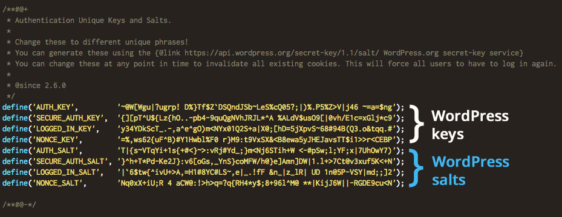

# Deployment Architecture Overview

The WordPress deployment is a custom configuration. It is deployed using a layered architecture within Kubernetes, consisting of an **application tier** and a **database tier**. Each component is independently managed, securely configured, and backed by persistent storage to ensure durability and scalability.

## Table of Contents

- [Main Components](#main-components)
  - [WordPress (Application Layer)](#wordpress-application-layer)
  - [MariaDB (Database Layer)](#mariadb-database-layer)
- [Configuration Steps](#configuration-steps)
  - [Prerequisites](#prerequisites)
  - [Step 1: Create Wordpress Namespace](#step-1-create-wordpress-namespace)
  - [Step 2: MariaDB Configuration and Secrets](#step-2-mariadb-configuration-and-secrets)
    - [2.1 Set Up MariaDB Database with Persistent Storage](#21-set-up-mariadb-database-with-persistent-storage)
    - [2.2 Deploy MariaDB Service](#22-deploy-mariadb-service)
    - [2.3 MariaDB Network Policy](#23-mariadb-network-policy)
    - [2.4 Deploy MariaDB StatefulSet](#24-deploy-mariadb-statefulset)
  - [Step 3: Deploy the Wordpress Application](#step-3-deploy-the-wordpress-application)
    - [3.1 Wordpress Configuration and Secrets](#31-wordpress-configuration-and-secrets)
    - [3.2 Generate the Wordpress Keys & Salts via Kubernetes Secret](#32-generate-the-wordpress-keys--salts-via-kubernetes-secret)
    - [3.3 Wordpress Service Account](#33-wordpress-service-account)
    - [3.4 Wordpress ConfigMap (Security Hardening)](#34-wordpress-configmap-security-hardening)
    - [3.5 Wordpress Storage Class](#35-wordpress-storage-class)
    - [3.6 Wordpress Persistent Volume](#36-wordpress-persistent-volume)
    - [3.7 Wordpress Network Policy](#37-wordpress-network-policy)
    - [3.8 Wordpress Deployment](#38-wordpress-deployment)
    - [3.9 Wordpress Service](#39-wordpress-service)
    - [3.10 Verify Wordpress Deployment](#310-verify-wordpress-deployment)
  - [Step 4: Wordpress Default Headers, Rate Limit, and Endpoint Restriction](#step-4-wordpress-default-headers-rate-limit-and-endpoint-restriction)
    - [4.1 Wordpress SSL Certificate and Ingress Route Configuration](#41-wordpress-ssl-certificate-and-ingress-route-configuration)
  - [Step 5: Configure DNS](#step-5-configure-dns)
  - [Step 6: Post-Deployment Hardening Verification](#step-6-post-deployment-hardening-verification)
    - [6.1 Verify Apache Version Hiding on Error Pages](#61-verify-apache-version-hiding-on-error-pages)
    - [6.2 Configure WordPress Permalinks (Avoid Soft 404s)](#62-configure-wordpress-permalinks-avoid-soft-404s)
- [Why BusyBox is Used in the Wordpress Deployment?](#why-busybox-is-used-in-the-wordpress-deployment)
  - [What is BusyBox?](#what-is-busybox)
- [Why we use it in the deployment:](#why-we-use-it-in-the-deployment)
  - [What is an initContainer?](#what-is-an-initcontainer)

## Main Components

### WordPress (Application Layer)

Deployed as a Kubernetes Deployment with **multiple replicas**, spread across nodes via `topologySpreadConstraints` so a single node failure cannot take down both pods. Pods share a `ReadWriteMany` (RWX) PVC mounted at `/var/www/html/wp-content` to keep `plugins`, `themes`, and `media uploads` consistent across replicas. Configuration values such as database credentials and authentication salts are injected via **Kubernetes Secrets**.

The container runs as a **non-root** user (UID 33) with `runAsNonRoot: true`, `readOnlyRootFilesystem: true`, the default seccomp profile, and only the `NET_BIND_SERVICE` capability (needed to bind port 80 as UID 33). Because the root filesystem is read-only, an `emptyDir` is mounted at `/var/www/html` for the WordPress image's entrypoint to populate on each pod start, with the `wp-content` PVC mounting on top to retain user data. Three probes (startup, liveness, readiness) hit `/wp-login.php` so Kubernetes can detect a hung or failing pod.

### MariaDB (Database Layer)

MariaDB is deployed as a **StatefulSet** to provide stable network identity and persistent storage. It maintains all WordPress relational data, including posts, users, settings, and metadata. The database uses a dedicated PersistentVolumeClaim (PVC) with **ReadWriteOnce** (RWO) access mode, to ensure data durability. Access credentials are stored securely in Kubernetes Secrets, and the service is exposed internally within the cluster for controlled communication from the WordPress pods.

The MariaDB container runs as UID 999 with `runAsNonRoot: true`, `readOnlyRootFilesystem: true`, the default seccomp profile, and all Linux capabilities dropped. Two `emptyDir` volumes (`/tmp` and `/var/run/mysqld`) handle the writes MariaDB needs outside the data volume — the Unix socket and temporary sort files. Three probes (startup, liveness, readiness) run `mariadb-admin ping` so Kubernetes can detect a hung database. The data volume is provisioned from the `mariadb` StorageClass with 2 Longhorn replicas and at-rest encryption.

Both MariaDB and WordPress are scoped by `NetworkPolicy` resources so each pod can only reach the destinations it actually needs.

**Caveat**: The MariaDB StatefulSet is deployed with `1` replica. Simply increasing `replicas` does **not** create a replicated database — it creates multiple independent MariaDB instances, each with their own PVC (provisioned by `volumeClaimTemplates`), that do not synchronize data. A ClusterIP service in front of them would round-robin requests across instances, causing writes to land on different MariaDBs and leading to data inconsistency and corruption from WordPress's perspective.

To scale MariaDB horizontally, you must set up **Galera Cluster** (multi-primary synchronous replication) or **primary-replica replication**, which requires additional configuration beyond changing the replica count. Do not attempt to scale by simply increasing `replicas` without a replication strategy in place. Likewise, do not attempt to share a single PersistentVolume across multiple pods — concurrent writes to the same on-disk InnoDB files will corrupt the database.

## Configuration Steps

Login with the service account on the control plane via `ssh`. Switch to the root user - `sudo su` then `cd ~`.

Download the repo on the control plane if you haven't, and navigate to `wordpress` directory to deploy `wordpress`. Use `git clone` or the `Download Zip` button to download the repo.

Replace **placeholders** for credentials with valid ones and adjust resources in the manifest files based on business needs or workload. Then follow the configuration below to deploy `wordpress`.

**Caveat**: All manifest files (configurations) should be installed in `wordpress` namespace. Before generating credentials with `CLI` tools, ensure credentials are not being logged in `history` by adding the following commands to `~/.bashrc`, if not already there. Add it below the settings for history length line.

Finally, generate strong, unique passwords with a password manager. Avoid generating passwords with **special characters** and **punctuations** to prevent them from breaking the installation. Use alphanumeric passwords (>= 18) and store them securely in a password manager.

```
# use nano to open the root user's bashrc file
nano .bashrc

# add the following configuration to prevent CLI tools from logging generated credentials in history
# display history commands timestamp
export HISTTIMEFORMAT="%F %T "

# ignore sensitive commands
export HISTIGNORE="echo*:*password*:*secret*:*token*:*htpasswd*:*base64*:openssl*"

# source bashrc file to load the configuration
source .bashrc
```

### Prerequisites

Both StorageClasses (`mariadb-storage.yaml` and `wordpress-storage.yaml`) configure at-rest encryption via Longhorn's CSI encryption feature, which requires a `longhorn-crypto` Secret in the `longhorn-system` namespace containing the encryption key. Create it before applying either StorageClass — without it, every PVC bound to these StorageClasses will hang in `Pending` with a CSI provisioner error.

See Longhorn's [Volume Encryption guide](https://longhorn.io/docs/latest/advanced-resources/security/volume-encryption/) for the exact Secret schema.

**Which `longhorn-crypto` field to back up**: the Secret contains six keys, but only `CRYPTO_KEY_VALUE` is the actual encryption passphrase — lose it and every encrypted PVC is unrecoverable. The other five fields are LUKS configuration metadata — not secret in themselves, but needed for offline recovery from a salvaged Longhorn replica image (without knowing the cipher + hash + key size + PBKDF, `cryptsetup open` can't unlock the volume even with the right key).

| Key | Sensitive? | Purpose |
|---|---|---|
| **`CRYPTO_KEY_VALUE`** | **Yes — back this up** | The passphrase LUKS uses to unlock every encrypted volume. |
| `CRYPTO_KEY_PROVIDER` | No | Usually `secret` — tells Longhorn the key comes from this Secret. |
| `CRYPTO_KEY_CIPHER` | No | Cipher (e.g., `aes-xts-plain64`). |
| `CRYPTO_KEY_HASH` | No | Hash algorithm used in key derivation (e.g., `sha256`). |
| `CRYPTO_KEY_SIZE` | No | Key size in bits (e.g., `256`). |
| `CRYPTO_PBKDF` | No | Password-based KDF (e.g., `argon2i`). |

`kubectl get secret -o yaml` returns base64-encoded values in the `data:` section, so decode before storing:

```
kubectl get secret longhorn-crypto -n longhorn-system \
  -o jsonpath='{.data.CRYPTO_KEY_VALUE}' | base64 -d
```

Decode the five LUKS configuration parameters in a single API call (the `if ne $k "CRYPTO_KEY_VALUE"` clause explicitly excludes the actual passphrase, so this command is safe to run without echoing the secret into terminal scrollback):

```
kubectl get secret longhorn-crypto -n longhorn-system \
  -o go-template='{{range $k,$v := .data}}{{if ne $k "CRYPTO_KEY_VALUE"}}{{$k}}: {{$v | base64decode}}
{{end}}{{end}}'
```

Store the decoded `CRYPTO_KEY_VALUE` in the password manager as the primary item, and record the five LUKS parameters as notes alongside it for offline recovery scenarios.

### Step 1: Create Wordpress Namespace

Switch to the **root** user and create a `wordpress` namespace to deploy `wordpress` in.

```
# switch to root user
sudo su
cd ~

# clone the repo to the root user's home directory (~) and change to wordpress directory
git clone <repo-url>
cd wordpress

# create wordpress namespace
kubectl create namespace wordpress

# swtich to the wordpress folder and verify all manifest files are intact
cd wordpress
ls
```

### Step 2: MariaDB Configuration and Secrets

> The `mariadb-secret.yaml` file in this directory is a **template** showing the Secret's shape. Don't edit it with real values or apply it directly — create the Secret imperatively so credentials never touch the repo. `kubectl create secret` base64-encodes values for you, so there's no manual encoding step.

Generate three strong alphanumeric credentials (>= 18 chars) in your password manager — one each for `username`, `password`, and `rootpw` — then create the Secret:

```bash
kubectl create secret generic mariadb -n wordpress \
  --from-literal=username='<db-username>' \
  --from-literal=password='<strong-password>' \
  --from-literal=rootpw='<strong-rootpw>'
```

Verify the Secret was created:

```bash
kubectl get secret mariadb -n wordpress
```

#### 2.1 Set Up MariaDB Database with Persistent Storage

MariaDB provides a robust, production-ready database backend that wordpress requires for storing posts, users, settings, and metadata. Deploy MariaDB as a **StatefulSet** with persistent storage to ensure data durability.

`mariadb-storage.yaml` defines the `mariadb` StorageClass with 2 Longhorn replicas, at-rest encryption, and a `Retain` reclaim policy. Confirm the `longhorn-crypto` Secret described in the Prerequisites section exists before applying.

Apply `mariadb-storage.yaml`:

```
kubectl apply -f mariadb-storage.yaml
```

#### 2.2 Deploy MariaDB Service

Apply `mariadb-service.yaml`:

```
kubectl apply -f mariadb-service.yaml
```

#### 2.3 MariaDB Network Policy

Apply `mariadb-network-policy.yaml` *before* the StatefulSet so the database pod comes up under policy from the start. The policy restricts ingress to TCP/3306 from pods labeled `app: wordpress` only, and egress to kube-dns only — every other connection is denied.

```
kubectl apply -f mariadb-network-policy.yaml
```

#### 2.4 Deploy MariaDB StatefulSet

Apply `mariadb-config.yaml`, `mariadb-service-account.yaml` and `mariadb-deployment.yaml` if the storage capacity and resources doesn't need to be adjusted:

```
kubectl apply -f mariadb-config.yaml
kubectl apply -f mariadb-service-account.yaml
kubectl apply -f mariadb-deployment.yaml
```

Verify the deployment is running:

```
kubectl get pods -n wordpress
kubectl get svc -n wordpress
kubectl get pvc -n wordpress
kubectl get secret -n wordpress
kubectl get networkpolicy -n wordpress
kubectl logs -n wordpress statefulset/mariadb
```

### Step 3: Deploy the Wordpress Application

Deploy wordpress with `/var/www/html/wp-content` mounted to store `plugins`, `themes`, and `media uploads` in the PersistentVolumeClaim (PVC).

#### 3.1 Wordpress Configuration and Secrets

Each WordPress pod auto-generates its own authentication salts if not explicitly defined. Since the wordpress deployment has more than **1** replica, a couple of issues such as an infinite login loop might occur. For instance:

- Login request hits Pod A → cookie created

- Next request hits Pod B → cookie invalid

- Redirect back to login

To mitigate this issue and have multiple wordpress replicas running consistently, a shared salt must be injected via Kubernetes `Secret`, to ensure all pods use the exact same keys. This ensures **cookies** and **nonces** are valid across replicas.

##### What are the Keys & Salts? 

WordPress uses `8` security keys and salts for authentication and data integrity. These are stored in the `wp-config.php` file.

Each key is basically a random string that WordPress combines with user passwords, cookies, and nonces to produce secure hashes.

<div align="center">
    
| Name | Purpose |
|---|---|
| `AUTH_KEY` | Signs the auth cookie for logged-in users |
| `SECURE_AUTH_KEY` | Signs the secure (HTTPS-only) auth cookie |
| `LOGGED_IN_KEY` | Signs the non-HTTPS cookie for users logged in |
| `NONCE_KEY` | Signs nonces (one-time tokens for forms/actions) |
| `AUTH_SALT` | Adds randomness to the auth cookie |
| `SECURE_AUTH_SALT` | Adds randomness to the secure auth cookie |
| `LOGGED_IN_SALT` | Adds randomness to the logged-in cookie |
| `NONCE_SALT` | Adds randomness to nonces |

</div>

 <p align="center">
      
</p>

#### 3.2 Generate the Wordpress Keys & Salts via Kubernetes Secret

Use the following command to generate the salts and keys in the **wordpress** namespace:

```
kubectl create secret generic wordpress-auth \
  --from-literal=AUTH_KEY="$(openssl rand -base64 32)" \
  --from-literal=SECURE_AUTH_KEY="$(openssl rand -base64 32)" \
  --from-literal=LOGGED_IN_KEY="$(openssl rand -base64 32)" \
  --from-literal=NONCE_KEY="$(openssl rand -base64 32)" \
  --from-literal=AUTH_SALT="$(openssl rand -base64 32)" \
  --from-literal=SECURE_AUTH_SALT="$(openssl rand -base64 32)" \
  --from-literal=LOGGED_IN_SALT="$(openssl rand -base64 32)" \
  --from-literal=NONCE_SALT="$(openssl rand -base64 32)" \
  -n wordpress
```

**Note**: This stores all 8 salts in a single Secret for multi-replica login consistency. The salts can also be generated from wordpress's API. However, this method has not been used or test. See [here](https://api.wordpress.org/secret-key/1.1/salt/)

Verify the keys & salts:

```
kubectl get secret -n wordpress
kubectl describe secret wordpress-auth -n wordpress
kubectl get secret wordpress-auth -o yaml -n wordpress
```

**Note**: `wordpress-auth` is the secret file name holding all the keys & salts. If you change the file name to a different name in the command to generate the keys & salts, ensure the file name correspond to the one specified in the second command.

#### 3.3 Wordpress Service Account

Apply `wordpress-service-account.yaml` for pod security standards and to ensure pods are not running as **root**:

```
kubectl apply -f wordpress-service-account.yaml
```

#### 3.4 Wordpress ConfigMap (Security Hardening)

Apply `wordpress-config.yaml` to disable `Apache` and `PHP` fingerprinting, and to set the `urls`. The Apache directive file is named `zz-hide-versions.conf` and mounted into `/etc/apache2/conf-enabled/` (not `conf-available/`) — see [Step 6.1](#61-verify-apache-version-hiding-on-error-pages) for the rationale and verification.

```
kubectl apply -f wordpress-config.yaml
```

#### 3.5 Wordpress Storage Class

`wordpress-storage.yaml` defines the `wordpress` StorageClass with 2 Longhorn replicas, at-rest encryption, and a `Retain` reclaim policy. The PVC in the next step is bound to this StorageClass — applying the PVC first would leave it stuck in `Pending`. Confirm the `longhorn-crypto` Secret described in the Prerequisites section exists before applying.

Apply `wordpress-storage.yaml`:

```
kubectl apply -f wordpress-storage.yaml
```

#### 3.6 Wordpress Persistent Volume

Apply `wordpress-pvc.yaml` to create a PersistentVolumeClaim for storing `plugins`, `themes`, and `media uploads`:

```
kubectl apply -f wordpress-pvc.yaml
```

#### 3.7 Wordpress Network Policy

Apply `wordpress-network-policy.yaml` *before* the Deployment so the WordPress pods come up under policy from the start. The policy restricts:

- **Ingress** to TCP/80 from the `traefik` namespace only.
- **Egress** to MariaDB (TCP/3306) by pod label, kube-dns (UDP/TCP 53), loopback via Traefik (TCP/443 — needed for `wp-cron`, REST self-calls, and the plugin/theme editor), external HTTPS (TCP/443) with RFC1918 ranges blocked, and external SMTP submission (TCP/587) with RFC1918 ranges blocked.

```
kubectl apply -f wordpress-network-policy.yaml
```

#### 3.8 Wordpress Deployment

Apply `wordpress-deployment.yaml` if the storage capacity and resources doesn't need to be adjusted:

```
kubectl apply -f wordpress-deployment.yaml
```

**Caveat: Updating WordPress core.** Do **not** update WordPress core from the dashboard (**Dashboard → Updates**). WordPress core files live in the ephemeral `wp-html` `emptyDir` volume, which is re-seeded from the container image every time a pod restarts. A dashboard update writes new core files into that `emptyDir`, so it is **lost on the next pod restart** and only ever reaches the single replica that served the request — leaving the other replica on the old version. The container image is the source of truth for the core version: the official `wordpress` entrypoint only seeds core into an *empty* volume, so the image tag fully determines which version runs.

To update WordPress core, bump the image tag in `wordpress-deployment.yaml` and re-apply:

```
# edit the image tag, e.g. wordpress:6.9.4-php8.5-apache
kubectl apply -f wordpress-deployment.yaml
kubectl rollout status deployment/wordpress -n wordpress
```

This performs a rolling update so every replica lands on the same version consistently. If the new version requires a database schema change, WordPress shows a one-time "Database Update Required" prompt after the rollout — completing it then is correct and safe.

Alternatively, patch the running deployment in place — useful for quick image bumps without editing the YAML, but update `wordpress-deployment.yaml` to match immediately afterward so the manifest stays the source of truth (otherwise the next `kubectl apply -f wordpress-deployment.yaml` will revert the tag):

```
kubectl set image deployment/wordpress wordpress=wordpress:6.9.4-php8.5-apache -n wordpress
kubectl rollout status deployment/wordpress -n wordpress
```

Plugins, themes, and media uploads live on the persistent `wp-content` PVC, so installing and updating **those** from the dashboard is fine — they persist and are shared across all replicas.

#### 3.9 Wordpress Service

Apply `wordpress-service.yaml`:

```
kubectl apply -f wordpress-service.yaml
```

#### 3.10 Verify Wordpress Deployment

Verify the wordpress deployment with the following commands:

```
kubectl get pods -n wordpress
kubectl get svc -n wordpress
kubectl get pvc -n wordpress
kubectl get networkpolicy -n wordpress
kubectl get configmap -n wordpress
kubectl get configmap wordpress-apache-config -o yaml -n wordpress
kubectl get configmap wordpress-config-extra -o yaml -n wordpress
kubectl get configmap wordpress-php-config -o yaml -n wordpress
```

### Step 4: Wordpress Default Headers, Rate Limit, and Endpoint Restriction 

Apply `default-headers.yaml` and `deny-endpoints.yaml`:

```
kubectl apply -f default-headers.yaml
kubectl apply -f deny-endpoints.yaml
```

#### 4.1 Wordpress SSL Certificate and Ingress Route Configuration

Apply `wordpress-certificate.yaml` and `ingress.yaml`:

```
kubectl apply -f wordpress-certificate.yaml
kubectl apply -f ingress.yaml
```

Verfiy the certificate, ingress route, default headers, endpoint restriction, and rate limit:

```
kubectl get certificate -n wordpress
kubectl get ingressroute -n wordpress
kubectl get middleware -n wordpress
```

Verify the deployment:

```
kubectl get pods -n wordpress
kubectl describe pod <wordpress-pod-name> -n wordpress
kubectl logs <wordpress-pod-name> -n wordpress 
```

**Note**: The domain name set in **wordpress-config.yaml** must match the ones in **wordpress-certificate.yaml**.

### Step 5: Configure DNS

Navigate to **Cloudflare** or your DNS provider.

Point an `A` record at the **designated ingress node's** public IP with the name set to the **Host** specified in the ingress route. If you already have a wildcard record (e.g. `*.example.com`) covering that hostname, no additional record is needed — the wildcard suffices.

**Note**: wildcards match exactly one label and do **not** cover the apex domain or deeper subdomains. For example, `*.example.com` covers `wp.example.com` but neither `example.com` nor `wp.apps.example.com` — those need their own records.

### Step 6: Post-Deployment Hardening Verification

Two hardening tasks must be confirmed after the deployment is live: the Apache version-disclosure suppression from Step 3.4 must actually be in effect on Apache's native error pages, and WordPress must be configured to return proper `404` statuses for non-existent URLs. Both were sources of real-world leakage during initial rollout — this section documents the chains of cause and effect and the verification commands so the same regressions don't recur on a future rebuild.

In every command below, replace `<your-domain>` with the FQDN configured in the ingress route.

#### 6.1 Verify Apache Version Hiding on Error Pages

The `wordpress-apache-config` ConfigMap from Step 3.4 disables Apache's version disclosure via two directives:

```
ServerTokens Prod
ServerSignature Off
```

- `ServerTokens Prod` reduces the `Server:` response header to just `Apache` (no version, no OS).
- `ServerSignature Off` removes the trailing `Apache/X.Y.Z (Debian) Server at <host> Port 80` footer from Apache's auto-generated error pages (404, 403, 405, etc.).

Two implementation details determine whether these directives actually take effect — both surfaced during initial rollout when the version still leaked from 404 pages despite the ConfigMap being applied.

**Mount location must be `conf-enabled/`, not `conf-available/`.** Debian's Apache packaging only loads configs from `/etc/apache2/conf-enabled/` (normally a symlink directory populated by `a2enconf`). With `readOnlyRootFilesystem: true` we cannot run `a2enconf` at startup, so the ConfigMap is mounted directly into `conf-enabled/` via a `subPath` — that bypasses the symlink workflow entirely.

**Filename must sort after `security.conf`.** Apache parses `conf-enabled/*.conf` in alphabetical order, and for single-valued directives like `ServerTokens`/`ServerSignature` the **last definition wins**. Debian's stock `security.conf` (also under `conf-enabled/`) sets `ServerTokens OS` and `ServerSignature On`. Any custom file whose name sorts before `security.conf` (e.g. `hide-versions.conf` at `h`) is silently overridden. The file is therefore named **`zz-hide-versions.conf`** — the `zz-` prefix is the conventional "load me last" marker (also seen in `/etc/sudoers.d/`, `/etc/profile.d/`) and guarantees our directives are the final word regardless of what else gets added to `conf-enabled/` later.

To verify, send a `TRACE` request to the site. Debian's `security.conf` ships `TraceEnable Off`, so Apache returns its own 405 page directly — this bypasses WordPress's `index.php` rewrite, which would otherwise mask the Apache error page entirely:

```
curl -sS -i -X TRACE https://<your-domain>/
```

**Before the fix** the response body (HTTP 405) contained:

```
<hr>
<address>Apache/2.4.66 (Debian) Server at <your-domain> Port 80</address>
```

**After the fix** both the `<hr>` and `<address>` lines are absent — `ServerSignature Off` is now in effect. Content-length on the same 405 response drops from `344` to `262` bytes.

To inspect the loaded config from inside the pod:

```
kubectl -n wordpress exec deploy/wordpress -- ls /etc/apache2/conf-enabled/
kubectl -n wordpress exec deploy/wordpress -- cat /etc/apache2/conf-enabled/zz-hide-versions.conf
kubectl -n wordpress exec deploy/wordpress -- apache2ctl -t -D DUMP_INCLUDES
```

The directory listing and `DUMP_INCLUDES` output should both show `zz-hide-versions.conf` **after** `security.conf` in alphabetical order.

**Note — response headers vs. error-page bodies are two separate leaks.** The Traefik `default-headers` middleware applied in Step 4 sets `Server: ""`, which strips the `Server:` header from every response at the proxy layer. That alone hides the version on regular requests, which can give a false sense that Apache hardening is working. It does **not** affect the bodies of Apache's auto-generated error pages — those are rendered by Apache and pass through Traefik unchanged. The `ServerSignature Off` directive (correctly loaded via the `zz-` prefix) is what plugs the second leak. Both layers are kept in place as defense-in-depth.

#### 6.2 Configure WordPress Permalinks (Avoid Soft 404s)

WordPress's default permalink setting is **Plain** (URLs like `/?p=123`). Combined with the official `wordpress` Docker image, this produces incorrect `200 OK` responses for non-existent URLs — a "soft 404" — which is harmful for SEO (Google treats them as duplicate-content copies of the homepage and can suppress legitimate pages) and confusing for monitoring or external link checkers.

The cause is a quirk of the Docker image's entrypoint, not a WordPress core bug:

1. The image's entrypoint script **unconditionally writes** a `.htaccess` to `/var/www/html/` containing a `mod_rewrite` block that rewrites every request not matching an existing file or directory to `/index.php`, **regardless of the configured permalink structure**.
2. With permalinks set to Plain, WordPress has no rewrite rules to parse the rewritten URL — it receives `/index.php` with no query parameters and cannot tell that a specific resource was requested.
3. WordPress then defaults to the home query (`is_home()` true) and returns **HTTP 200** with the homepage body. The expected `is_404()`-true / HTTP 404 path is never reached.

Switching to any non-Plain permalink structure restores correct behavior, because WordPress can then parse the original URL against the permalink rules, fail to match, and properly set the 404 status.

In `wp-admin → Settings → Permalinks`, choose any structure other than Plain — **Day and name**, **Month and name**, **Post name**, or a custom structure all work. Save Changes. WordPress regenerates the in-DB permalink structure and (when filesystem permits) rewrites `.htaccess`.

Verify with:

```
curl -sS -o /dev/null -w 'final=%{http_code}\nurl=%{url_effective}\n' \
  -L https://<your-domain>/this-definitely-does-not-exist
```

Expected output **before** the permalink change:

```
final=200
url=https://<your-domain>/this-definitely-does-not-exist/
```

(Note `200` — soft 404 — and the trailing-slash canonical redirect that WordPress applies before serving the homepage.)

Expected output **after** the permalink change:

```
final=404
url=https://<your-domain>/this-definitely-does-not-exist
```

If `final=200` persists, re-save the Permalinks page in wp-admin to force regeneration of the rewrite rules, then retest.

**Note — why this is not addressed by Step 6.1's Apache hardening.** The Apache `ServerSignature` / `ServerTokens` directives only apply to error pages Apache itself generates (e.g. a `TRACE` request that returns 405 before reaching WordPress). Browser requests to non-existent URLs are caught by `.htaccess` and handed to WordPress, which produces its own response — Apache's error directives never enter that path. The permalink fix is therefore complementary to, and not replaceable by, the Apache hardening.

---

## Why BusyBox is Used in the Wordpress Deployment?
### What is BusyBox?

[BusyBox](https://en.wikipedia.org/wiki/BusyBox) is often called **"the Swiss Army knife of Linux utilities."**

It’s a very small Linux container image that includes common Unix commands like `sh`, `ls`, `cp`, `mv`, `chmod`, `chown`, `mkdir`, and more — all in one executable.

The official image busybox:1.36 is lightweight (a few MB), making it ideal for short tasks or initContainers.

We don’t run a full OS; we just get a minimal shell environment.

## Why we use it in the deployment:

We need to execute commands like `chown` and `chmod` inside the pod before WordPress starts.

BusyBox is perfect because it’s minimal, fast, and includes exactly what we need.

No need to use the heavier WordPress image just for a quick file-permission fix.

### What is an initContainer?

An initContainer is a special container in Kubernetes that:

- Runs before the main containers in the pod start.

- Must complete successfully before the main container starts.

It is perfect for setup tasks like:

- Setting file permissions

- Downloading configuration files

- Waiting for dependencies to be ready

In our deployment, initContainers ensures that `/var/www/html/wp-content` has the correct ownership and permissions before WordPress starts, preventing startup failures.

This is attained with the following configuration in the initContainer:

- `sh -c` runs a shell command.

- `chown -R 33:33` recursively sets user ID 33 and group ID 33 (WordPress default UID/GID) as owner of **"/var/www/html/wp-content"**.

- `chmod -R 775` makes the directory and its contents readable, writable, and executable by owner and group, readable by others.

- This ensures WordPress can write to uploads, themes, and plugins without errors.

- `securityContext`

    ```yaml
    runAsUser: 0
    runAsNonRoot: false
    privileged: false
    allowPrivilegeEscalation: false
    capabilities:
      drop:
        - ALL
      add:
        - CHOWN
        - FOWNER
    ```

    - `runAsUser: 0` runs the initContainer as root. Root privileges are needed to change ownership of files on a PVC mounted from a storage backend (Longhorn, NFS, etc.). After it finishes, the main WordPress container runs as UID 33.

    - `runAsNonRoot: false` is an explicit override of the pod-level `runAsNonRoot: true`. The override is scoped to this one initContainer only, so the main container still enforces non-root.

    - `privileged: false` and `allowPrivilegeEscalation: false` keep the container off the host's privilege surface even while running as UID 0. A root user inside a container with these flags off cannot gain new capabilities and cannot interact with the host kernel privileged paths.

    - `capabilities: drop [ALL]` strips every Linux capability, then `add: [CHOWN, FOWNER]` re-adds only the two needed for the `chown -R` + `chmod -R` step. `CHOWN` permits changing file ownership; `FOWNER` permits bypassing the "you must be the owner to chmod" check (relevant when re-running against files chowned to UID 33 by a previous init). This is the least-privilege form of "run as root" — far narrower than the default capability set Kubernetes hands root containers.

- `resources`
    ```yaml
    requests:
      cpu: 50m
      memory: 32Mi
    limits:
      cpu: 100m
      memory: 64Mi
    ```

    - The chown/chmod step is transient and tiny, but explicit requests + limits keep it from being scheduled on overloaded nodes and prevent a misbehaving init from starving the node.

- `volumeMounts`
    ```
    - name: wp-content
      mountPath: /var/www/html/wp-content
    ```
    
    - Mounts the WordPress content PVC inside the initContainer.

    - This is the directory that needs the permission fix.
