# MetalLB Load Balancer Installation on Kubernetes Cluster

A load balancer is responsible for providing a single IP address to route incoming requests to applications. To successfully create Kubernetes services of type `LoadBalancer`, a load balancer implementation compatible with Kubernetes is required.

Since bare-metal environments lack load balancers by default, services of type `LoadBalancer` will remain in a `pending` state indefinitely when created. 

As a result, bare-metal cluster operators are left with two lesser tools to bring user traffic into their clusters; `NodePort` and `externalIPs` services. Both of these options have significant downsides for production use, which makes bare-metal clusters second-class citizens in the Kubernetes ecosystem.

MetalLB aims to address this imbalance by offering a network load balancer implementation that integrates with standard network equipment, so that external services on bare-metal clusters also "just work" as much as possible.

This documentation walks you through the installation of a MetalLB load balancer on a Kubernetes cluster, enabling the same type of external access for consumers. After installation, [Traefik](https://traefik.io/traefik) will be deployed as a service type `LoadBalancer` to allow ingress access to exposed services and applications.

Note: This guide assumes you have a Kubernetes cluster running on bare-metal nodes. MetalLB should be installed on the `control plane` or a `designated ingress node` that is publicly exposed to the internet. In other words, this should be a server with both a public and a private IP address.

## Table of Contents

- [What is MetalLB](#what-is-metallb)
  - [Requirements](#requirements)
- [Installation Steps](#installation-steps)
  - [Create a Load Balancer Services Pool of IP Addresses](#create-a-load-balancer-services-pool-of-ip-addresses)
- [MetalLB Docs](#metallb-docs)
  - [Upgrade](#upgrade)

## What is MetalLB

[MetalLB](https://metallb.io/) is a pure software solution that provides a network load-balancer implementation for Kubernetes clusters that are not deployed in supported cloud providers (AWS, GCP, Azure, etc), using standard routing protocols.

### Requirements

MetalLB requires the following to function:

- A Kubernetes cluster, running Kubernetes 1.13.0 or later, that does not already have network load-balancing functionality.
- A [cluster network configuration](https://metallb.io/installation/network-addons/) that can coexist with MetalLB.
- Some IPv4 addresses for MetalLB to hand out.
- When using the BGP operating mode, you will need one or more routers capable of speaking BGP.
- When using the L2 operating mode, traffic on port 7946 (TCP & UDP, other port can be configured) must be allowed between nodes, as required by [memberlist](https://github.com/hashicorp/memberlist).

## Installation Steps

Login with the service account on the control plane or designated ingress node via `ssh`. Switch to the root user - `sudo su` then `cd ~`.

1. Verify that the Kubernetes cluster API is responsive and that you can use the `kubectl` command-line tool for cluster administration:

    ```
    kubectl cluster-info
    ```

     <p align="center">
      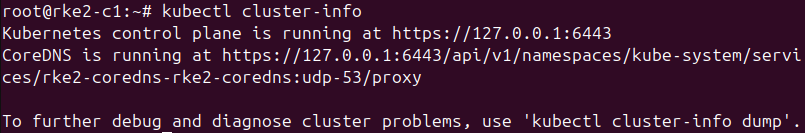
    </p>

2. Install `curl` and `wget` utilities if not available already on the control plane or designated ingress node:

    ```
    # Debian / Ubuntu 
    apt update && sudo apt install wget curl -y
    
    # CentOS / RHEL / Fedora
    yum -y install wget curl
    ```

3. If you’re using [`kube-proxy`](https://metallb.io/installation/#installation-by-manifest) in IPVS mode, since Kubernetes `v1.14.2`, you have to enable strict `ARP` mode:

    ```
    kubectl edit configmap -n kube-system kube-proxy

    # see what changes would be made, returns nonzero returncode if different
    kubectl get configmap kube-proxy -n kube-system -o yaml | \
    sed -e "s/strictARP: false/strictARP: true/" | \
    kubectl diff -f - -n kube-system
    
    # actually apply the changes, returns nonzero returncode on errors only
    kubectl get configmap kube-proxy -n kube-system -o yaml | \
    sed -e "s/strictARP: false/strictARP: true/" | \
    kubectl apply -f - -n kube-system
    ```

    Note: At the time of installation and documentation, `kube-proxy` in IPVS mode was not enabled on your organization's setup. Only apply these changes when it's enabled.

4. Download MetalLB installation manifest with the latest MetalLB release tag:

    ```
    MetalLB_RTAG=$(curl -s https://api.github.com/repos/metallb/metallb/releases/latest|grep tag_name|cut -d '"' -f 4|sed 's/v//')
    ```

5. Use `echo` command to check the release tag:

    ```
    echo $MetalLB_RTAG
    ```

     <p align="center">
      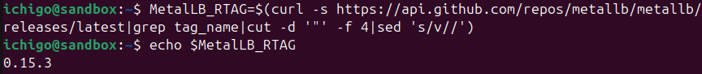
    </p>

6. Create a directory where the manifest file will be downloaded to:

    ```
    mkdir ~/metallb && cd ~/metallb
    ```

7. Download the MetalLB installation manifest:

    ```
    wget https://raw.githubusercontent.com/metallb/metallb/v$MetalLB_RTAG/config/manifests/metallb-native.yaml
    ```

    Below are the components in the manifest file:

    - The `metallb-system/controller` deployment – Cluster-wide controller that handles IP address assignments.
    - The `metallb-system/speaker` daemonset – Component that speaks the protocol(s) of your choice to make the services reachable.
    - Service accounts for both controller and speaker, along with RBAC permissions that the components need to function.

8. Install MetalLB within the Kubernetes cluster by applying the manifest. This will install it in the `metallb-system` namespace:

    ```
    kubectl apply -f metallb-native.yaml
    ```

9. Use the following commands to verfiy the installation:

    ```
    # Continuously monitors all resources (pods, services, deployments, etc.) in the metallb-system namespace
    watch kubectl get all -n metallb-system

    ## To kill the watch
    Ctrl + C

    # Watches only the pods in the metallb-system namespace in real-time
    kubectl get pods -n metallb-system --watch

    ## To kill the watch
    Ctrl + C
    ```

10. Verify all pods are in `Running` state:

    ```
    kubectl get pods -n metallb-system
    ```

    <p align="center">
      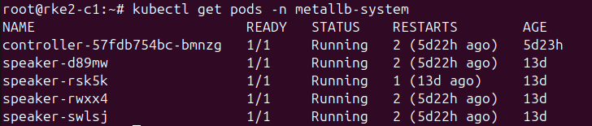
    </p>

11. Use the following commands to list all services and endpoints:

    ```
    kubectl get all -n metallb-system
    kubectl get endpoints -n metallb-system
    ```

    <p align="center">
      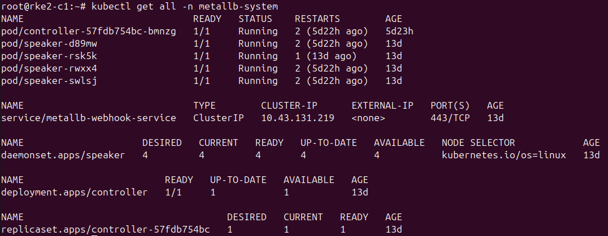
    </p>

    <p align="center">
      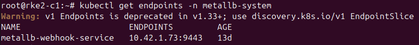
    </p>

    If all steps are followed through, all MetalLB components will be started, but will remain in idle state until all necessary [configurations](https://metallb.universe.tf/configuration/) are completed.

### Create a Load Balancer Services Pool of IP Addresses

MetalLB needs a pool of IP addresses to assign to services when it gets such request. Therefore, MetalLB has to be configured to do so via the `IPAddressPool` CR.

1. **Define the IPs to assign to the Load Balancer services**: Create a configuration file in the `metallb` directory that defines the IP address pools MetalLB uses to assign IPs to services and in order to advertise the IP coming from an IPAddressPool, an L2Advertisement instance must be associated to the IPAddressPool.

    For this configuration, MetalLB is given control over only the control plane / designated ingress node's public IPv4 with configured [L2 mode](https://metallb.universe.tf/configuration/#layer-2-configuration). Use `ip a` to procure the control plane / designated ingress node's public IP address.

   ```
   nano ~/metallb/ipaddress_pools.yaml

   # paste the configuration
   
   apiVersion: metallb.io/v1beta1
    kind: IPAddressPool
    metadata:
      name: <name>
      namespace: metallb-system
    spec:
      addresses:
      - <designated-ingress-node-public-ip/subnet>
    ---
    apiVersion: metallb.io/v1beta1
    kind: L2Advertisement
    metadata:
      name: <name>
      namespace: metallb-system

   # save the file
   Ctrl + X, then Y, then Enter
   ```

   <p align="center">
      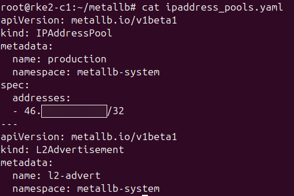
    </p>

    The IP addresses can be defined by `CIDR`, `range`, and both IPV4 and IPV6 addresses can be assigned. Multiple instances of `IPAddressPool` can also be defined in a single definition.

   <p align="center">
      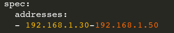
    </p>

    <p align="center">
      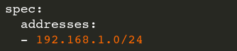
    </p>

    <p align="center">
      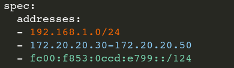
    </p>

    Advertisement can also be limited to a specific Pool. In the example below, advertisement is limited to the production pool.

   <p align="center">
      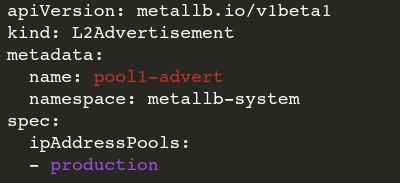
    </p>

2. Apply the configuration using `kubectl` command:

    ```
    kubectl apply -f  ~/metallb/ipaddress_pools.yaml
    ```

3. List the created IP Address Pools and Advertisements:

    ```
    kubectl get ipaddresspools.metallb.io -n metallb-system
    kubectl get l2advertisements.metallb.io -n metallb-system
    ```

    <p align="center">
      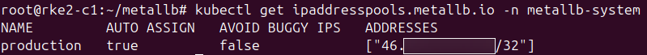
    </p>

    <p align="center">
      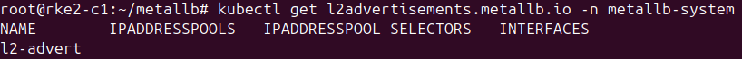
    </p>
   
4. Get more details using `describe` kubectl command option:

    ```
    kubectl describe ipaddresspools.metallb.io <ipaddresspool-name> -n metallb-system
    ```

    <p align="center">
      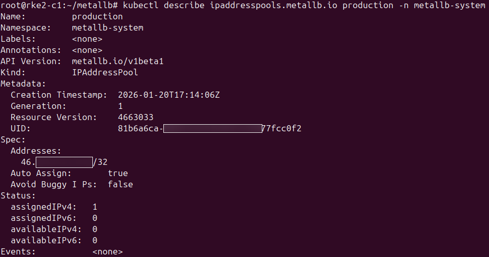
    </p>

5. Installation should be successful and ready for use with [Traefik](https://traefik.io/traefik) for ingress access to applications and services.

## MetalLB Docs

MetalLB [doc](https://metallb.io/) and [github](https://github.com/metallb/metallb) for more information.

### Upgrade

When upgrading MetalLB, always check the [release notes](https://metallb.io/release-notes/) to see the changes and required actions, if any. Pay special attention to the release notes when upgrading to newer major/minor releases.

Unless specified otherwise in the release notes, upgrade MetalLB using one of the methods described above:

- [Plain manifests](https://metallb.io/installation/#installation-by-manifest)
- [Kustomize](https://metallb.io/installation/#installation-with-kustomize)
- [Helm](https://metallb.io/installation/#installation-with-helm)

When upgrading via `Helm`, note that the chart is designed to automatically upgrade the CRDs; there is no need to upgrade them manually.

Please take note of the known limitations for [layer2](https://metallb.io/concepts/layer2/#limitations) and [bgp](https://metallb.io/concepts/bgp/#limitations) into account when performing an upgrade.

    
   
   

