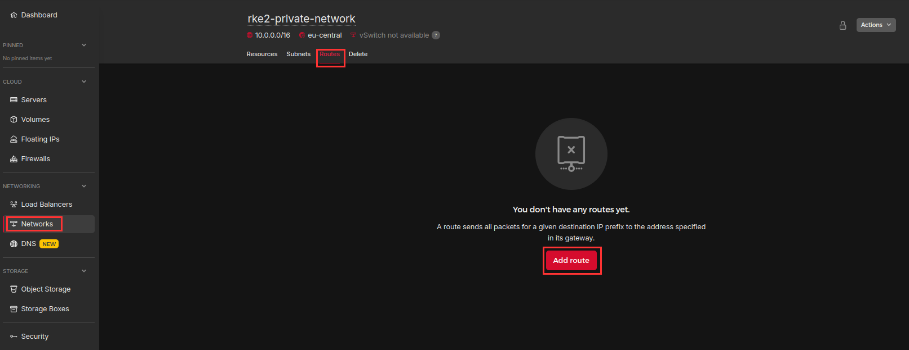
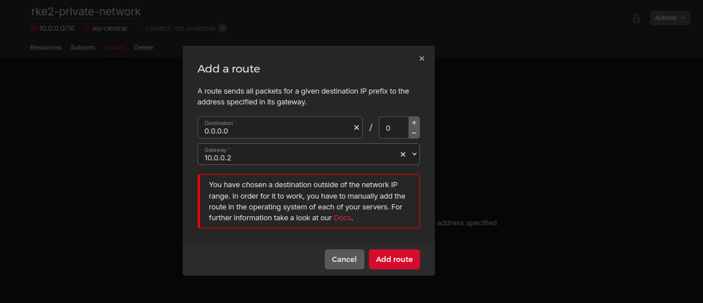
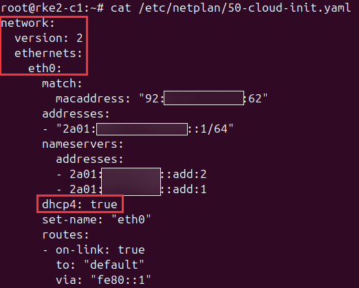
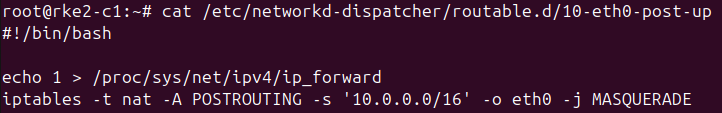
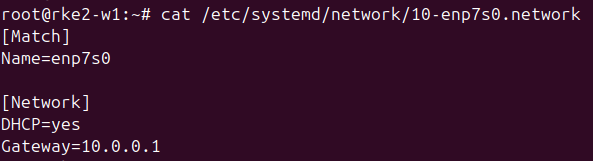
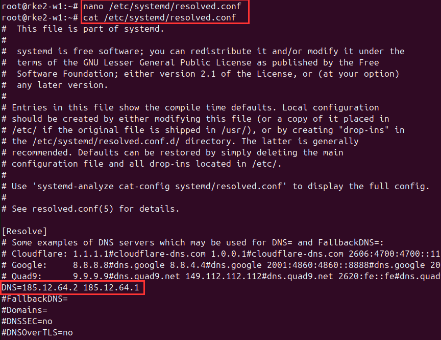
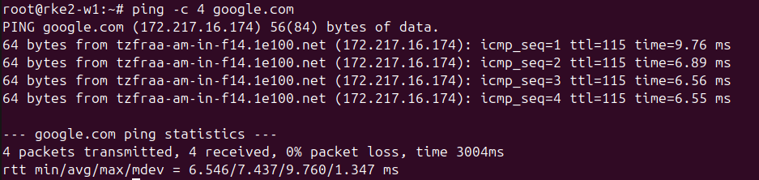

# NAT Gateway Configuration on Control & Worker Nodes

Setting up the control plane as a `NAT gateway` enables worker nodes in a private network—without public IP addresses—to securely access the internet for essential outbound connectivity. 

This design allows workers to pull container images, fetch OS and package updates, all while remaining non-addressable from the public internet.

The configuration steps are outlined below and were tested on `Hetzner Cloud` VPS at the time of documentation. 

## Note

- All servers have to be in the same private Cloud Network.
- This configuration can be replicated on `Ubuntu 18.04, 20.04, 22.04, and 24.04`
  - `Debian 10, 11, 12 and 13` (On Debian 12, please install systemd-resolved before you follow this tutorial)
  - `CentOS 7`
  - `CentOS Stream 8, 9 and 10`
  - `Fedora 36, 37, 41 and 42`
  - `Rocky Linux 8, 9 and 10`
- Example terminology:
  - Network: `10.0.0.0/16`
  - Gateway: `10.0.0.1`
  - NAT server: `10.0.0.2`
- Please replace `10.0.0.0/16` with your own network, `10.0.0.1` with your network gateway IP, and `10.0.0.2` with the private IP of your own NAT server in all example commands.
- The `NAT` server could be any server within your cluster with a public and private IP.
- The control plane is used as the `NAT` server in this case, because it has a public and private IP.

## Table of Contents

- [Step 1 - Creating the Network and Servers](#step-1---creating-the-network-and-servers)
- [Step 2 - Adding the Route to the Network](#step-2---adding-the-route-to-the-network)
- [Step 3 - Configuring NAT](#step-3---configuring-nat)
- [Step 4 - Achieving a Persistent Configuration](#step-4---achieving-a-persistent-configuration)
- [Step 5 - Adding Nameservers](#step-5---adding-nameservers)
- [Conclusion](#conclusion)

## Steps

This setup walks you through a generic NAT gateway for Cloud Servers via private Cloud Networks. It explains how to create the Private Network for the servers, how to setup the routing, and how to achieve a persistent configuration. 

### Step 1 - Creating the Network and Servers

If you haven't provisioned the servers with a private network. Please refer to [Create a New Server & Private Network for Control plane](ubuntu-setup-and-user-provisioning.md#create-a-new-server--private-network-for-control-plane) section in `ubuntu-setup-and-user-provisioning` documentation on how to do so.

### Step 2 - Adding the Route to the Network

For the setup to work properly, the following route needs to be added to the private network:
- Destination: `0.0.0.0/0`
- Gateway: `10.0.0.2`

The `gateway` should be the private IP address of the `NAT` server (server with both public and private IP) to configure masquerading. In this case, that would be the control plane's private IP address.

1. On Hetzner Cloud dashboard, navigate to `Networks ➜ Select the private network created in step 1 ➜ Routes ➜ Add route` to create a route.

    <p align="center">
      
    </p>

2. Set the destination to all interfaces (`0.0.0.0`), the subnet to `0`, and the gateway to `10.0.0.2` (control plane private IP). Then click `Add route` to save the route.

    <p align="center">
      
    </p>

### Step 3 - Configuring NAT

To configure the `NAT` server, use the following command on the control server:

1. Enable IP forwarding, since it is disabled by default.

    ```
    echo 1 > /proc/sys/net/ipv4/ip_forward
    ```

2. Add a rule to the `nat` table.

    ```
    iptables -t nat -A POSTROUTING -s '10.0.0.0/16' -o eth0 -j MASQUERADE
    ```
    Second command in more detail:
     
    - `iptables` ➜ command-line utility for configuring Linux kernel's built-in firewall
    - `-t nat` ➜ choose the table `nat`
    - `-A POSTROUTING` ➜ add a rule to postrouting
    - `-s '10.0.0.0/16'` ➜ target packets from the source `10.0.0.0/16`
    - `-o eth0` ➜ output at `eth0`
    - `-j MASQUERADE` ➜ masquerade the packages with the `routers` IP
  
3. To configure the client servers (workers), only add a default route.

   - To avoid issues with the DHCP client, make sure `hc-utils` is disabled or uninstalled first as explained [here](uninstalling-or-deactivating-auto-configuration-package.md#uninstalling-the-auto-configuration-package). The latter is preferred.

   On the worker server(s), run the following command and `10.0.0.1` should be replaced with your private network gateway IP:
   ```
   ip route add default via 10.0.0.1
   ```

    <details>
      <summary>Click here if you get RTNETLINK answers: File exists</summary>
    
      <p>
        If you get the error <code>RTNETLINK answers: File exists</code>, run the following command
        to check if you already have a default route:
      </p>
    
      <pre>
    ip route
      </pre>
    
      <p>Example output:</p>
    
      <pre>
    default via 172.31.1.1 dev eth0
    10.0.0.0/16 via 10.0.0.1 dev enp7s0
    10.0.0.1 dev enp7s0 scope link
    172.31.1.1 dev eth0 scope link
      </pre>
    
      <p>You can remove the existing default route with this command:</p>
    
      <pre>
    ip route del default
      </pre>
    
      <p>After removal, try adding the new route again:</p>
    
      <pre>
    ip route add default via 10.0.0.1
      </pre>
    </details>

### Step 4 - Achieving a Persistent Configuration

To make the configuration persistent, run the following commands as root user (Ubuntu 22.04/Ubuntu 24.04):

First, update the system(s):

```
apt update && apt upgrade -y
```

#### On the NAT Server (Control Plane)

1. To make everything persistent on the `NAT` server (control plane), open the `50-cloud-init.yaml` file in `/etc/netplan`:

    ```
    nano /etc/netplan/50-cloud-init.yaml
    ```
2. Check if the following attributes are set. If everything looks fine, exit out the file with `Ctrl + X`. Otherwise, modify it and save the file with `Ctrl + X`, then `Y`, then press `Enter`:

    ```
    network:
    version: 2
    ethernets:
        eth0:
            dhcp4: true
    ```
    
    <p align="center">
      
    </p>
    
3. Now create a new file in `/etc/networkd-dispatcher/routable.d`:

    ```
    nano /etc/networkd-dispatcher/routable.d/10-eth0-post-up
    ```

4. Add the following to the file and save it with `Ctrl + X`, then `Y`, then `Enter`:

    ```
    #!/bin/bash

    echo 1 > /proc/sys/net/ipv4/ip_forward
    iptables -t nat -A POSTROUTING -s '10.0.0.0/16' -o eth0 -j MASQUERADE
    ```

    <p align="center">
      
    </p>

    Note: Replace `10.0.0.0/16` with your private network subnet.

5. Add execute permissions to the file:

    ```
    chmod +x /etc/networkd-dispatcher/routable.d/10-eth0-post-up
    ```

#### On the Client Servers (Workers)

1. Edit the following file to make the route persistent on the worker server(s):
   
   - Run `ifconfig` to check the interface name and replace `enp7s0` with `ens10` if needed.

    ```
    nano /etc/systemd/network/10-enp7s0.network
    ```

3. Add the following in the file:

    ```
    [Match]
    Name=enp7s0
    
    [Network]
    DHCP=yes
    Gateway=10.0.0.1
    ```

    <p align="center">
      
    </p>

    Note: Replace `10.0.0.1` with your private network gateway IP.

4. Save the file with `Ctrl + X`, then `Y`, then `Enter`.

### Step 5 - Adding Nameservers

To add nameservers on the client servers (workers), edit the file `/etc/systemd/resolved.conf`. In the section `[Resolve]`, there should be the line `#DNS=`. Un-comment this line by removing the `#` and add some DNS servers or use the DNS servers by Hetzner:

  ```
  [Resolve]
  DNS=185.12.64.2 185.12.64.1
  ```

 <p align="center">
      
    </p>

Save and restart the worker servers:
```
Ctrl + X, then Y, then Enter
reboot
```

Finally, verify the worker server(s) have internet access (outbound) after rebooting:
```
ping -c 4 google.com
```

<p align="center">
      
    </p>

## Conclusion

Following all the steps outlined above should successfully configure the control plane to act as a `NAT` router within the private cloud network.

On the NAT server (control plane), use `iptables -t nat -L` to confirm the configuration. On the other hand, use `ip route show` to confirm the configuration on the worker nodes.

Refer to the [srv-security-and-firewall-config](srv-security-and-firewall-config.md) documentation to configure the firewall rules for system administration, `RKE2`'s Networking & Inbound Network rules, as well as to allow traffic through the private interface `enp7s0` and forwarded via the public interface `eth0 ` - this should be configured on the `NAT` server (control plane).
    
  
   


