# Safely Drain a Node

This documentation explains how to safely drain a node, optionally respecting the PodDisruptionBudget you have defined.

## Table of Contents

- [Before We Begin](#before-we-begin)
  - [Configure a Disruption Budget (Optional)](#configure-a-disruption-budget-optional)
- [Use Kubectl Drain to Remove a Node from Service](#use-kubectl-drain-to-remove-a-node-from-service)
  - [Step 1: Identify the Name of the Node You Wish to Drain](#step-1-identify-the-name-of-the-node-you-wish-to-drain)
  - [Step 2: Tell Kubernetes to Drain the Node](#step-2-tell-kubernetes-to-drain-the-node)
  - [Step 3: PodDisruptionBudget Error](#step-3-poddisruptionbudget-error)
  - [Step 4: Use the Production-safe Drain Command](#step-4-use-the-production-safe-drain-command)
  - [Step 5: Perform Maintenance on the Drained Node (Removed from Service)](#step-5-perform-maintenance-on-the-drained-node-removed-from-service)
  - [Step 6: Mark the Drained Node for Scheduling](#step-6-mark-the-drained-node-for-scheduling)
  - [Step 7: Apply the Same Steps to Other Nodes](#step-7-apply-the-same-steps-to-other-nodes)
- [Related Resources](#related-resources)

## Before We Begin

This task assumes you have met the following prerequisites:

- You do not require your applications to be highly available during the node drain, or
- You have read about the [PodDisruptionBudget](https://kubernetes.io/docs/concepts/workloads/pods/disruptions/) concept, and have configured [PodDisruptionBudgets](https://kubernetes.io/docs/tasks/run-application/configure-pdb/) for applications that need them.

### Configure a Disruption Budget (Optional)

To ensure that your workloads remain available during maintenance, you can configure a [PodDisruptionBudget](https://kubernetes.io/docs/concepts/workloads/pods/disruptions/).

If availability is important for any applications that run or could run on the node(s) that you are draining, [configure a PodDisruptionBudgets](https://kubernetes.io/docs/tasks/run-application/configure-pdb/) first and then continue following this guide.

It is recommended to set AlwaysAllow [Unhealthy Pod Eviction Policy](https://kubernetes.io/docs/tasks/run-application/configure-pdb/#unhealthy-pod-eviction-policy) to your PodDisruptionBudgets to support eviction of misbehaving applications during a node drain. The default behavior is to wait for the application pods to become [healthy](https://kubernetes.io/docs/tasks/run-application/configure-pdb/#healthiness-of-a-pod) before the drain can proceed.

## Use Kubectl Drain to Remove a Node from Service

We can use `kubectl drain` to **safely evict all of pods from a node** before performing maintenance on the node (e.g. kernel upgrade, hardware maintenance, etc.). Safe evictions allow the pod's containers to gracefully terminate and will respect the **PodDisruptionBudgets** you have specified.

> Note: By default **kubectl drain** ignores certain system pods on the node that cannot be killed; see the [kubectl drain](https://kubernetes.io/docs/reference/generated/kubectl/kubectl-commands/#drain) documentation for more details.

When kubectl drain returns successfully, that indicates that all of the pods (except the ones excluded as described in the previous paragraph) have been safely evicted (respecting the desired graceful termination period, and respecting the PodDisruptionBudget you have defined). It is then safe to bring down the node by powering down its physical machine or, if running on a cloud platform, deleting its virtual machine.

> Caveat: If any new Pods tolerate the **node.kubernetes.io/unschedulable** taint, then those Pods might be scheduled to the node you have drained. Avoid tolerating that taint other than for DaemonSets.
> If you or another API user directly set the nodeName field for a Pod (bypassing the scheduler), then the Pod is bound to the specified node and will run there, even though you have drained that   node and marked it unschedulable.

### Step 1: Identify the Name of the Node You Wish to Drain

Use the commands below to list all nodes in your cluster:

```
# basic check
kubectl get nodes

# Check for pods with local storage
kubectl get pods --all-namespaces -o wide --field-selector spec.nodeName=<node-name> \
-o jsonpath='{range .items[*]}{.metadata.namespace}/{.metadata.name}: {.spec.volumes[*].emptyDir}{"\n"}{end}'
```

<p align="center">
  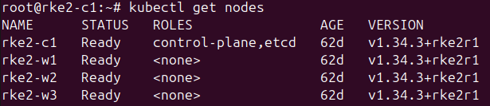
</p>

<p align="center">
  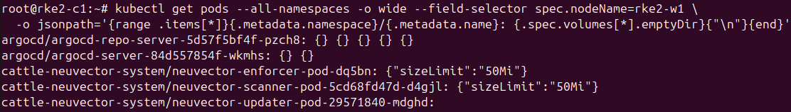
</p>

### Step 2: Tell Kubernetes to Drain the Node

If there are pods managed by a `DaemonSet`, you will need to specify `--ignore-daemonsets` switch with **kubectl** to successfully drain the node. The kubectl drain subcommand on its own does not actually drain a node of its DaemonSet pods: the DaemonSet controller (part of the control plane) immediately replaces missing Pods with new equivalent Pods. The DaemonSet controller also creates Pods that ignore unschedulable taints, which allows the new Pods to launch onto a node that you are draining.

```
kubectl drain --ignore-daemonsets <node name>
```

<p align="center">
  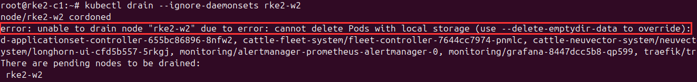
</p>

In some cases, the command might not work and throw an error such as "unable to drain node 'rke2-w2' due to error: cannot delete Pods with local storage". This is due to data residing in **emptyDir** volumes on the node you're trying to drain. Therefore, add the `--delete-emptydir-data` switch to override this.

> Caveat: Data in emptyDir will be lost! Ensure the application(s) with data in emptydir can handle the loss of the data.

```
kubectl drain --ignore-daemonsets <node name> --delete-emptydir-data
```

<p align="center">
  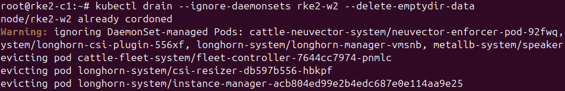
</p>

### Step 3: PodDisruptionBudget Error

The commands stipulated in step 2 might not work in cases where a pod/application has PodDisruptionBudget configured. For example, if **Longhorn** is configured with a PodDisruptionBudget of **Min Unavailable** set to `1`, then this may throw an error similar to the one below:

```
error when evicting pods/"instance-manager-ca7d107121b02651c32389e8b73988ab" -n "longhorn-system" (will retry after 5s): Cannot evict pod as it would violate the pod's disruption budget.
```

<p align="center">
  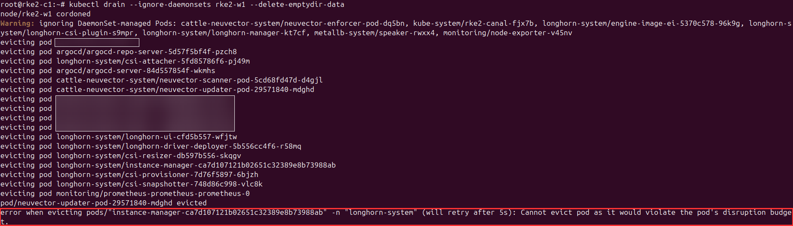
</p>

Use the command below to identify pods across all namespaces with PodDisruptionBudget:

```
kubectl get pdb --all-namespaces
```

> Note: if `Allowed Disruptions` is set to `0` for some pods, then eviction will be blocked.

<p align="center">
  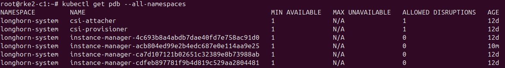
</p>

Then identify which pod on the node you're trying to drain is blocking eviction. In this example, the node to be drained is `rke2-w1`:

```
# instance-manager pod is the pod blocking eviction on the node (rke2-w1) to be drained
kubectl -n longhorn-system get pod -o wide | grep instance-manager
```

<p align="center">
  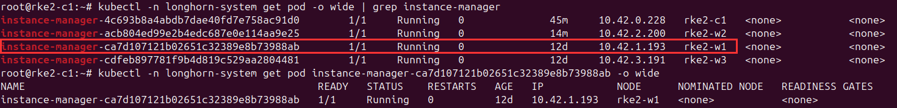
</p>

Once you've identified the pod, check whether that node still hosts active Longhorn engine/replica processes. This is the most important check. 

So in Longhorn UI, navigate to `Volumes` and look for attached volumes, degraded volumes, and replicas located on the node to be drained.

Or use `kubectl` to inspect any volumes, replicas, or engines on the node that needs to be drained:

```
kubectl -n longhorn-system get volumes.longhorn.io
kubectl -n longhorn-system get replicas.longhorn.io
kubectl -n longhorn-system get engines.longhorn.io
```

If there are any **PVC replicas** on the node that needs to be drained, then this is most likely one of the root cause to why eviction was blocked. In this case, Longhorn instance manager has a PodDisruptionBudget of `1` Minimum Available pod with no disruption allowed, because `Allowed Disruptions` is set to `0`.

<p align="center">
  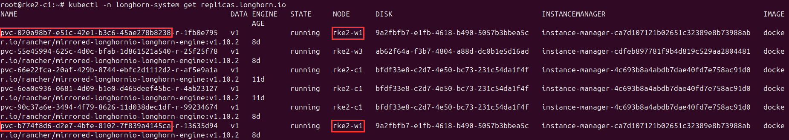
</p>

To rectify this and allow eviction to be successful, check if the PVC(s) on the node that needs to be drained has their replicas set to greater than `1`. If the replica is set to `1`, increase it to `2` and wait for the second (new) PVC replica to be fully rebuilt and healthy on another node.

This allows the PVC replica on the node that needs to be drained to be evicted while complying with the PodDisruptionBudget of `1` Minimum Available pod.

Before that, you need to know the **namespace** and **application** the PVC replica belongs to. Use the command below to identify that:

> Note: In this case, `pvc-020a98b7-e51c-42e1-b3c6-45ae278b8238` and `pvc-b774f8d6-d2e7-4bfe-8102-7f839a4145ca` are the PVC replicas blocking eviction on the node that needs to be drained and this was identified in the output of `kubectl -n longhorn-system get replicas.longhorn.io`.

```
kubectl get pvc -A | grep <pvc-name>
```

<p align="center">
  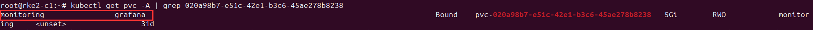
</p>

> Note: In the screenshot above, the affected PVC replica belongs to `Grafana` and it's in the `monitoring` namespace. Repeat the same command for other PVC replicas to identify the namespace and application they belong to.

Once you've identified the namespace and application the PVC(s) belong to, navigate to **Longhorn UI > Volumes > the affected PVC > drop down button in the Operation column**. Then click `Update Replica Count` to increase the replica to `2`.

> Caveat: Ensure that the new PVC replica is spawned on a different node and the PVC is fully rebuilt and healthy. Lastly, ensure there is ample storage on other nodes the PVC replica might be deployed to, to preclude any errors. 

<p align="center">
  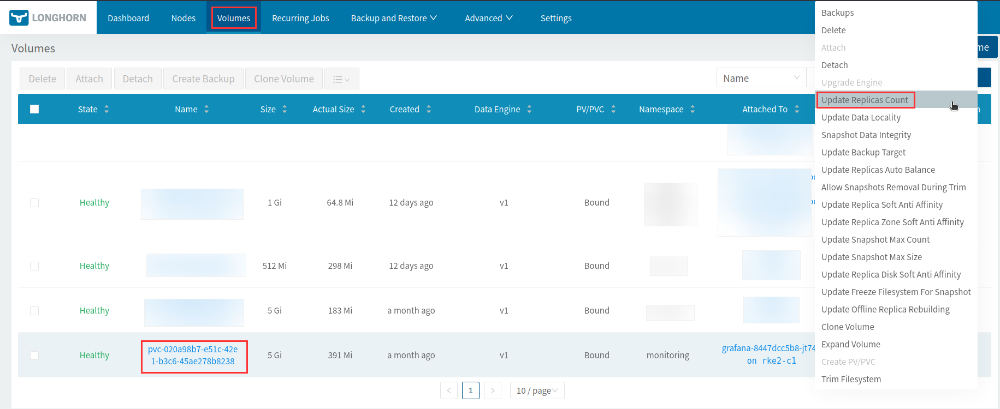
</p>

### Step 4: Use the Production-safe Drain Command

After all affected PVC replicas on the node that needs to be drained have been deployed to other nodes, use the command below to safely trigger the eviction of all pods:

```
kubectl drain <node-name> \
  --ignore-daemonsets \
  --delete-emptydir-data \
  --grace-period=60 \
  --timeout=300s
```

<p align="center">
  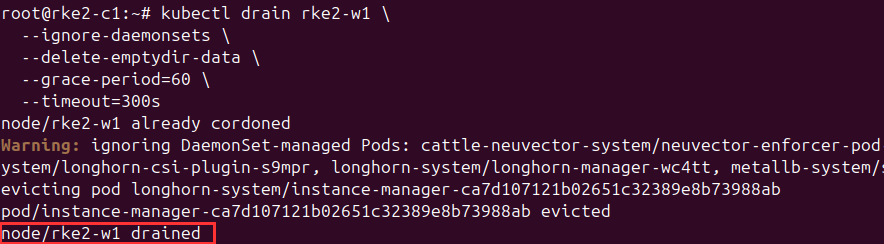
</p>

Verify the status of the node that needs to be drained:

```
kubectl get nodes
```

> Note: if the status is `Ready,SchedulingDisabled` and the drain command outputs `node/<node-name> drained`, it means the node is successfully drained and all pods deployed on it are evicted.

<p align="center">
  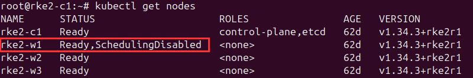
</p>

### Step 5: Perform Maintenance on the Drained Node (Removed from Service)

Once the production-safe drain command is completed without giving any error, you can power down the node (or equivalently, if on a cloud platform, delete the virtual machine backing the node). 

For instance, if the drained node needs to be rebooted for kernel upgrade, use the commands below to do so:

```
# connect to the node via ssh
ssh -i <private-key> <svc-acc-username@node-ip>

# update and upgrade system packages with either of the commands
apt full-upgrade -y 
apt update && apt upgrade -y

# reboot the node if kernel needs to be loaded into memory 
reboot
```

> Note: Depending on how SSH is configured for remote access into the nodes/vps, the SSH command might differ. So refer to [ssh-access-to-worker-srv-via-ctrl-plane](ssh-access-to-worker-srv-via-ctrl-plane.md) documentation to see how it's configured for this environment.
> Lastly, **do not delete the VPS backing any drained node in production**, unless you're certain and the VPS is backed up.

### Step 6: Mark the Drained Node for Scheduling

Finally, once the drained node has been successfully rebooted and maintenance is completed, you need to mark it for scheduling (**uncordon**) so Kubernetes can resume scheduling new pods onto the node.

Use the commands below to do so:

```
# mark the node as schedulable
kubectl uncordon <node-name>

# verify the status
kubectl get nodes
```

<p align="center">
  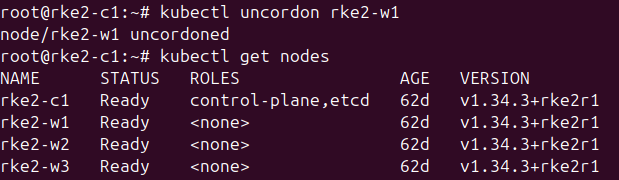
</p>

### Step 7: Apply the Same Steps to Other Nodes

Repeat steps 1 through 7 to drain other nodes for maintenance.

## Related Resources

- [K8s documentation on how to safely drain a node](https://kubernetes.io/docs/tasks/administer-cluster/safely-drain-node/)
- [How to Drain and Cordon Kubernetes Nodes for Maintenance](https://oneuptime.com/blog/post/2026-01-19-kubernetes-drain-cordon-node-maintenance/view)
