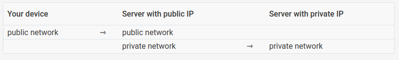
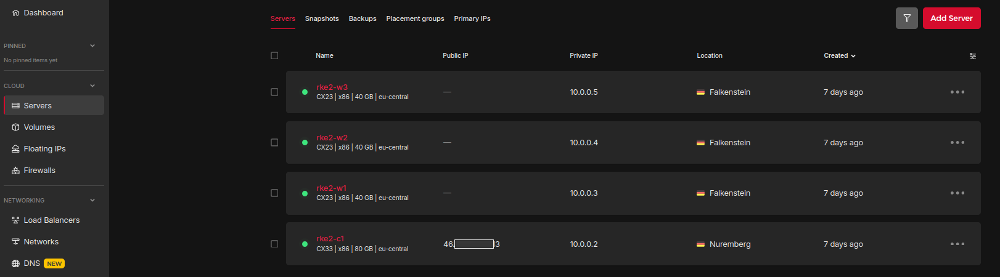
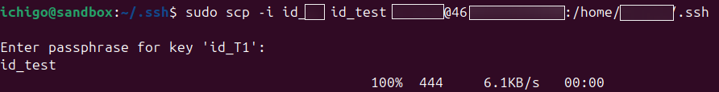
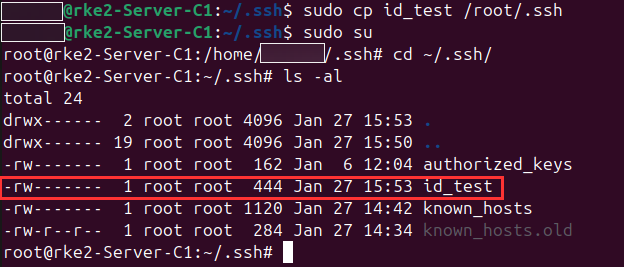
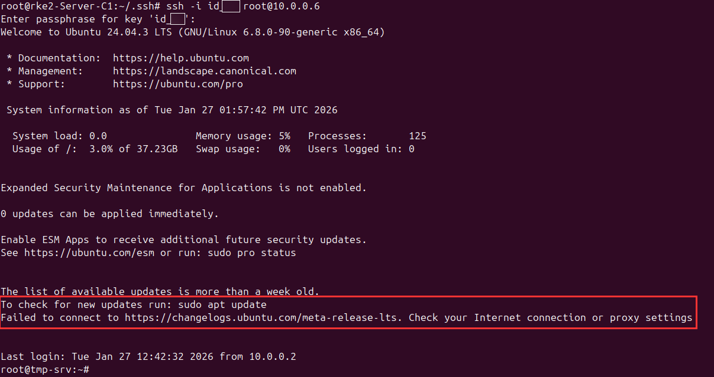
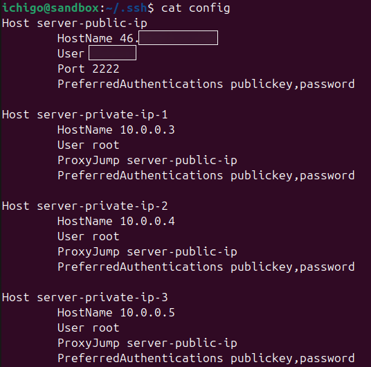
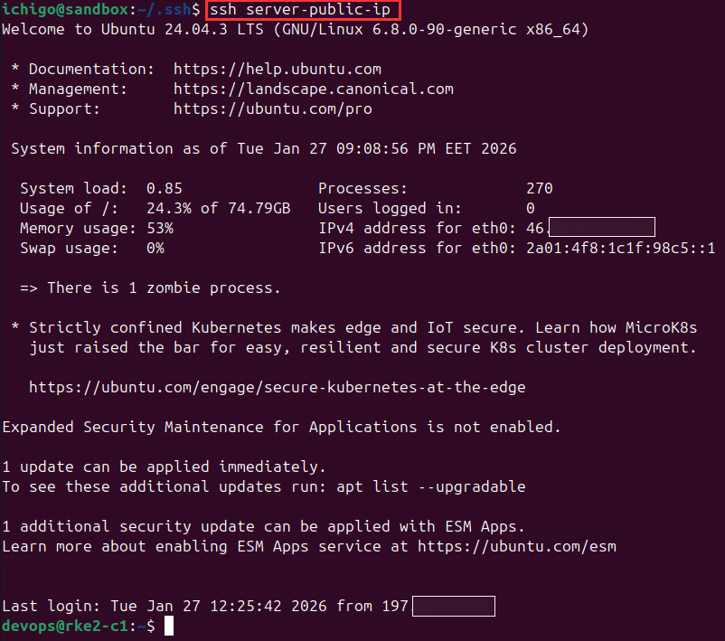
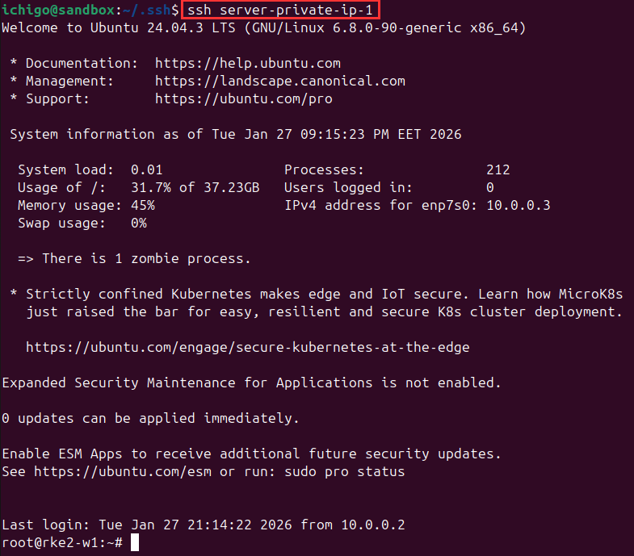

# SSH Access to Worker Node Server(s) via Control Plane Server

After provisioning the control plane server(s) with both a public and a private IP address, and the worker node server(s) with only private IP addresses, servers that are assigned private IPs are not directly reachable from external networks. 

<p align="center">
  
</p>

To access these servers (workers), connections must be initiated through a gateway or bastion host that has a public IP address and network-level reachability to the private subnet. Administrative access (for example, via SSH) is established by first connecting to the public-facing server (control plane) and then forwarding the connection internally to the target private IP. As long as this server is in the same private network as the server(s) without public IPs, ssh access can be established.

<p align="center">
  
</p>

This approach preserves network isolation, reduces the exposed attack surface, and enforces controlled access to internal resources.

## Steps

1. Connect to the control plane server from your local PC (external client) via ssh:

    ```
    sudo ssh -i <private-key> <username@server-public-ip> -p 2222
    ```
    
    Note: Login with the same service account created in [ubuntu-setup-and-user-provisioning](ubuntu-setup-and-user-provisioning.md) documentation.

2. Switch to the root user and change to the root user's ssh directory - `/root/.ssh`:

    ```
    sudo su
    cd /root/.ssh or cd ~/.ssh
    ```
3. Copy the private key attached to the worker server during provisioning, from your local PC (external client) to `/root/.ssh`:
   Use secure copy (scp) from your local PC to copy it to the control plane's service account `.ssh` directory and then copy it to `/root/.ssh` or manually copy paste it to `/root/.ssh`. The former is preferred. Lastly, change      the file permissions to `0600` to grant only the      owner read & write permissions.

     ```
     sudo scp -i <private-key> /path/to/local/file/or/directory <username@server-public-ip:/path/to/remote/destination/
     # Ex:
     sudo scp -i <private-key> ~/.ssh/id_test <devops@server-public-ip:/home/devops/.ssh/>
     sudo cp <private-key> /root/.ssh/
     chmod 0600 <private-key>

     # manual method
     sudo su
     cd ~/.ssh
     nano <file-name>
     Ctrl + Shift + V to copy the private key
     Ctrl + X , then Y, then Enter to save
     chmod 0600 <file-name>
     ```

    <p align="center">
      
    </p>
    
    <p align="center">
      
    </p>
     
     Note: When using scp from your local PC, use the service account username instead of the root user because root login via ssh has been disabled earlier in [ubuntu-setup-and-user-provisioning](ubuntu-setup-and-user-provisioning.md). Additionally, if you opt to copy the private key manually to the root user's `.ssh` directory, ensure there is no trailing whitespace at the end of the file before saving it.

5. Use the private key on the control plane to ssh into the worker server. Enter the passphrase when prompted:

    ```
    ssh -i <private-key> <root@worker-private-ip>
    ```
    <p align="center">
      
    </p>
    
    Note: Use the root user because no other user has been created on the worker. Also, notice that the worker server has no internet access for now. See [nat-gateway-config](nat-gateway-config.md) documentation on how to provision internet access to the worker server(s).

### SSH Configuration

To simplify SSH access to the worker server(s) within the private network, an SSH configuration file can be defined on an external client to route connections through a jump server via SSH [ProxyJump](https://www.strongdm.com/blog/ssh-proxyjump) feature. 

By specifying the publicly accessible host (control plane) as an intermediary in the SSH config, SSH automatically forwards the connection to the target private host without requiring manual port forwarding or multi-step login commands.

#### Steps

1. On your local PC (external client), create a `config` file in your ssh directory (`~/.ssh`) and add the following configurations:

    ```
    nano ~/.ssh/config
    
    Host <unique-name>
            HostName <control-plane-public-ip>
            User <service account username>
            Port 2222
            PreferredAuthentications publickey,password
    
    Host <unique-name>
            HostName <worker-node-1-private-ip>
            User root
            ProxyJump <control-plane-unique-name>
            PreferredAuthentications publickey,password
    
    Host <unique-name>
            HostName <worker-node-1-private-ip>
            User root
            ProxyJump <control-plane-unique-name>
            PreferredAuthentications publickey,password
    
    Host <unique-name>
            HostName <worker-node-1-private-ip>
            User root
            ProxyJump <control-plane-unique-name>
            PreferredAuthentications publickey,password
    ```

    <p align="center">
      
    </p>

2. Save the file and ensure it has the right file permissions (`0600`):

    ```
    Ctrl + X, then Y, then Enter to save
    chmod 0600 config
    ```

3. Ensure the attached key pair is in your ssh directory.

4. Test the configuration by specifying the unique name for each host. Enter the passphrase to establish connection when prompted:

   ```
   ssh <unique-name> # prepend the command with sudo if access is denied
   ``` 
    <p align="center">
      
    </p>

    <p align="center">
      
    </p>

5. Successful connection should be established.

## SSH Key Rotation Policy

To comply with industry security standards and best practices, ssh key(s) should be rotated every `90` to `120` days with strong passphrase (>= 18 characters) implemented.
