# Ubuntu 24.04 server provisioning on Hetzner
Below are the steps to spin up Ubuntu 24.04 images for your organization's staging and/or production environment. More control planes can be added to the cluster for better high availability (HA).

# High-Level Architecture Overview
The reference Kubernetes architecture is `1 control plane` with `3 worker nodes` — it is built to accommodate more control plane(s) and worker(s) for high availability (HA).
<div align="center">

<pre>
┌───────────────────────────┐
│        Control Plane      │
│        (rke2-server)      │
│                           │
│  - kube-apiserver (6443)  │
│  - etcd (embedded)        │
│  - controller-manager     │
│  - scheduler              │
│  - cloud-controller (opt) │
└──────────────┬────────────┘
               │
───────────────┼────────────────
               │
┌───────────────┐   ┌───────────────┐   ┌───────────────┐
│ Worker Node 1 │   │ Worker Node 2 │   │ Worker Node 3 │
│ (rke2-agent)  │   │ (rke2-agent)  │   │ (rke2-agent)  │
│               │   │               │   │               │
│ - kubelet     │   │ - kubelet     │   │ - kubelet     │
│ - containerd  │   │ - containerd  │   │ - containerd  │
│ - kube-proxy  │   │ - kube-proxy  │   │ - kube-proxy  │
│ - CNI plugins │   │ - CNI plugins │   │ - CNI plugins │
└───────────────┘   └───────────────┘   └───────────────┘
</pre>

</div>

## Table of Contents

1. [Network Addressing Model and Security Rationale](#network-addressing-model-and-security-rationale)
2. [Image Provisioning on Hetzner](#image-provisioning-on-hetzner)
3. [Generate and Upload SSH key to Hetzner](#generate-and-upload-ssh-key-to-hetzner)
4. [Create a New Server & Private Network for Control plane](#create-a-new-server--private-network-for-control-plane)
5. [Create a New Server for Worker Nodes](#create-a-new-server-for-worker-nodes)
6. [Caveat](#caveat)
7. [Initial Server Access & Service Account Provisioning on Control Plane Server](#initial-server-access--service-account-provisioning-on-control-plane-server)
8. [Disable Root Access & Change SSH Port Number](#disable-root-access--change-ssh-port-number)

## Network Addressing Model and Security Rationale
The cluster follows a segmented networking model designed to balance operational accessibility with security hardening. 

The control plane node is provisioned with both a `public IP address` and a `private IP address`. The public IP is required to allow controlled external access for cluster 
administration (e.g., ssh access, kubectl access, CI/CD integrations, and management tooling), while all internal cluster communication—including API server traffic from worker 
nodes—is bound to the private IP. This ensures that control-plane services are reachable only through explicitly permitted entry points and firewall rules.

In contrast, worker nodes are assigned private IP addresses exclusively and are not directly exposed to the public internet. Administrative access to worker nodes is performed 
indirectly via the control plane, which acts as a secure jump server (bastion host). SSH connections from external clients terminate on the control plane and are then forwarded 
to worker nodes over the private network, ensuring that worker nodes remain unreachable from external networks. All ingress traffic to workloads running on worker nodes is 
routed through designated entry points on `traefik` (load balancer and ingress controller). 

Additionally, outbound internet access for worker nodes, including operating system updates and package retrieval, is routed through the control plane, which functions as a NAT 
gateway for the private network. This design centralizes egress traffic, enables tighter monitoring and policy enforcement, and prevents direct external connectivity from worker nodes.

## Image Provisioning on Hetzner
This section outlines a repeatable process for provisioning Ubuntu 24.04 servers on Hetzner with security and operational best practices in mind.

### Generate and Upload SSH key to Hetzner

1. In your local PC's `.ssh` directory (external client), generate an [ed25519](https://www.brandonchecketts.com/archives/ssh-ed25519-key-best-practices-for-2025) SSH key pair if you do not already have one. Use strong passphrase on it:
    ```
    ssh-keygen -t ed25519 -C "<email or comment>"
    ```
    Note: Use passbolt or other password managers to generate and store the passphrase (>= 18 characters) securely.

<p align="center">
  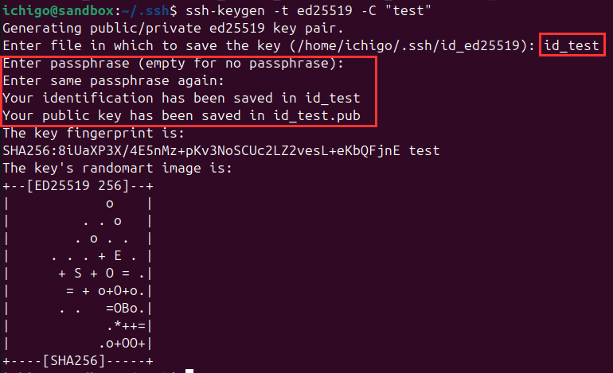
</p>

2. Log in to the Hetzner Cloud Console and navigate to `Security → SSH Keys` on the left panel. Click `Add SSH key` and paste the contents of your public key (~/.ssh/<id_name>.pub) - this is     generated in your `.ssh` directory from `step 1`.

<p align="center">
  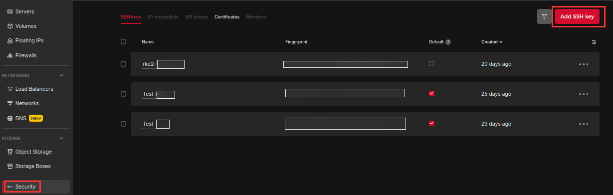
</p>

3. Give it a name and click `Add SSH key` to save it.

<p align="center">
  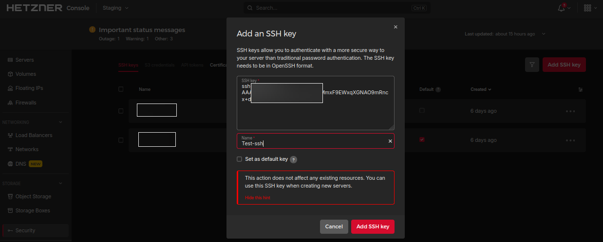
</p>

### Create a New Server & Private Network for Control plane

1. On Hetzner cloud console, go to `Servers → Add Server`. Select `Cost-Optimized` as the `Type`, `x86 Intel/AMD` as the architecture, and choose a resource category below it.

<p align="center">
  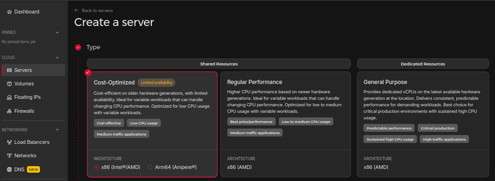
</p>

2. Select a location (preferably close to your users or other infrastructure) and choose `Ubuntu 24.04` as the image.

<p align="center">
  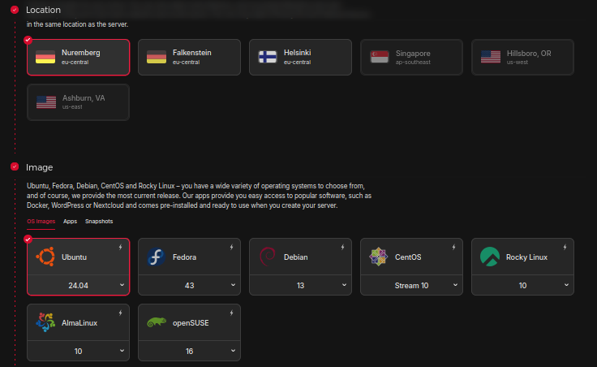
</p>

3. For Networking, check `Public IPv4`, `Public IPv6`, and `Private Networks`.

<p align="center">
  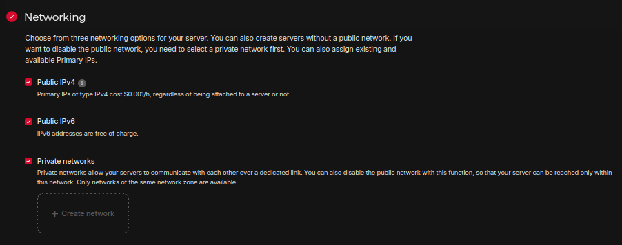
</p>

4. Then create a private network in a `/16` subnet by clicking `Create network` and give it a name.

<p align="center">
  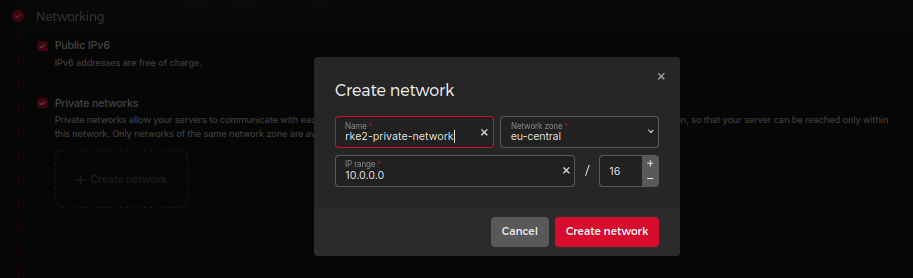
</p>

5. Attach your uploaded SSH key by selecting it.

<p align="center">
  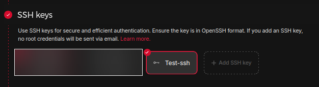
</p>

6. Navigate to `Firewalls → Create Firewall` on the left panel. Give it a name and click `Create Firewall`.

<p align="center">
  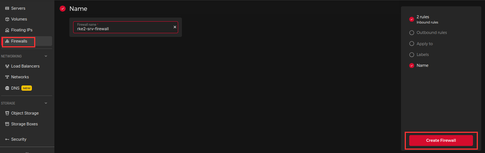
</p>

7. Add the following rules below to the newly created firewall appliance. Change port `2222` to `22` in the meantime. This will enable you to ssh into the server. After a service acount/user has been created on the server, with modifications to `ssh` config file, change the port number back to `2222`. See step 10 in [Disable Root Access & Change SSH Port Number](#disable-root-access--change-ssh-port-number) section.

<p align="center">
  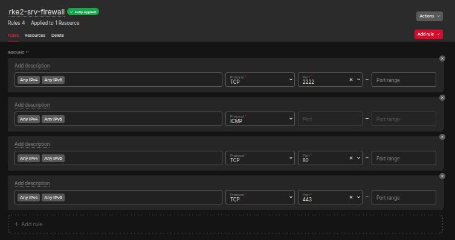
</p>

8. Then attach the firewall to the server.

<p align="center">
  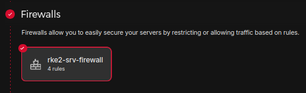
</p>

9. Assign a hostname to the server and ensure the configurations above are applied correctly. Then click `Create & Buy now`

<p align="center">
  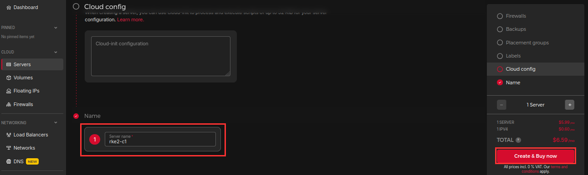
</p>

### Create a New Server for Worker Nodes
Repeat the same steps in [Create a New Server & Private Network for Control plane](#create-a-new-server--private-network-for-Control-plane) section to create a worker node server but exclude steps `6, 7 & 8`.

#### Caveat

1. For step `3`, check only `Private Networks` and attach the same private network created in step `4`. Do not check `Public IPv4` and `Public IPv6` for the worker node server. See [Network Addressing Model and Security Rationale](#network-addressing-model-and-security-rationale) section for more details as to why.

<p align="center">
  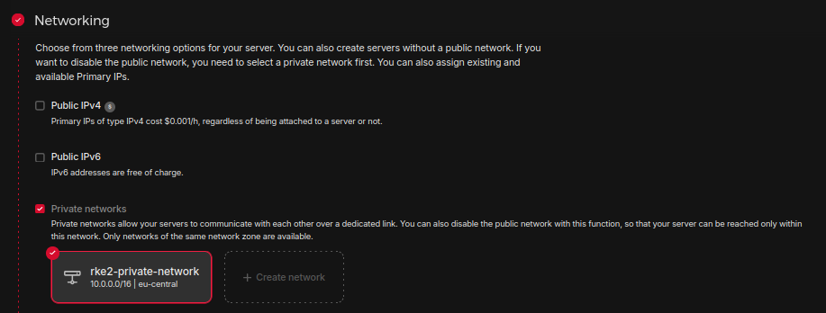
</p>

2. Worker node server(s) do not require hetzner firewall since they are not publicly accessible.

3. Ensure you attach the same ssh public key used for the control plane server to the worker node(s).

4. Ensure all configurations stipulated in this sub-section and in [Create a New Server for Worker Nodes](#create-a-new-server-for-worker-nodes) are correct before performing step `9`.

## Initial Server Access & Service Account Provisioning on Control Plane Server

A service account needs to be provisioned on the control plane server to disable `root` access via ssh login and to comply with industry best practices. Additionally, the default port number (22) for SSH has to be changed to port `2222` to alleviate ssh brute force attacks.

The service account username can be `devops` for example.

1. SSH into the control plane server using its public IP. Use `root` as the username with the private ssh key and enter the passphrase:
    
    ```
    sudo ssh -i <private-key> <root@server-public-ip>
    ssh -i <private-key> <root@server-public-ip> # windows client
    ``` 

2. Create a new user:
    ```
    adduser <username>
    ```
    Note: Follow the prompt to set a fullname and strong password (>= 18 characters) for the user. Other user information can be filled optionally.

3. Add the user to the sudo group:

    ```
    usermod -aG sudo <username>
    ```

4. Configure passwordless `sudo`:

    ```
    echo "<username> ALL=(ALL) NOPASSWD:ALL" | sudo tee /etc/sudoers.d/<username>
    ```
    Note: Set this only for service accounts or authorized users because it allows the user to run `sudo` commands without password prompts when authenticated via SSH key.

5. Set proper permissions on the sudoers file:

    ```
    chmod 0440 /etc/sudoers.d/<username>
    ```

6. Create a `.ssh` directory for the new user and copy the ssh key from the root user to the new user's `.ssh` directory:

    ```
    mkdir -p /home/<username>/.ssh
    cp /root/.ssh/authorized_keys /home/<username>/.ssh/
    ```
    Note: This should be configured for only authorized service accounts or users.

7. Set proper ownership and permissions:

    ```
    chown -R <username>:<username> /home/<username>/.ssh
    chmod 700 /home/<username>/.ssh
    chmod 600 /home/<username>/.ssh/authorized_keys
    ```

8. Test ssh connection with new user:

   Before disabling root access, verify you can connect with the new user. Open a new terminal window (keep your current session open) and test:
    
    ```
    sudo ssh -i <private-key> <username@server-public-ip> # for linux client
    ssh -i <private-key> <username@server-public-ip> # for windows client
    ```
    Note: Enter the passphrase set for the user when prompted.

9. Verify `sudo` permissions with the new user:

    ```
    sudo whoami
    ```

    Note: This should return `root`, confirming sudo privileges works correctly. Also, do not close your root session until you’ve confirmed the new user works!

### Disable Root Access & Change SSH Port Number

1. Once you’ve confirmed the new user can connect to the server and has sudo privileges, disable root SSH access for enhanced security:

    ```
    sudo nano /etc/ssh/sshd_config
    ```

2.  Find and uncomment the following line:

    ```
    PermitRootLogin prohibit-password
    ```

3. Change `prohibit-password` to `no`:

    ```
    PermitRootLogin no
    ```

4. Save the file (Ctrl + X, then Y, then Enter) and restart ssh service to apply the changes:

    ```
    sudo systemctl restart ssh
    ```

5. Limit ssh session timeout (optional) to enhance security for idle SSH sessions, especially useful for production environments, set a 15-minute timeout.

    ```
    sudo nano /etc/ssh/sshd_config
    ```

6. Add or modify these lines:

    ```
    ClientAliveInterval 900
    ClientAliveCountMax 2
    ```

7. This will disconnect idle sessions after 15 minutes (900 seconds). Restart ssh service to apply the changes:

    ```
    sudo systemctl restart ssh
    ```
    
8. Change ssh default port number (22) to port (2222):

    ```
    sudo nano /etc/ssh/sshd_config
    change 22 to 222 and uncomment the line
    Ctrl + X, then Y, then Enter to save
    ```

    <p align="center">
      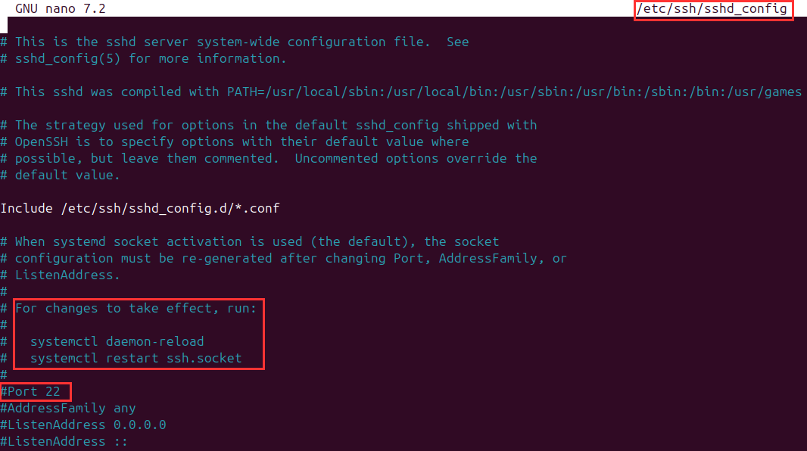
    </p>
   
9. Reload and restart the socket daemon for the effect to take place:

    ```
    sudo systemctl daemon-reload
    sudo systemctl restart ssh.socket
    ```

10. Terminate the current session and navigate back to the firewall appliance on Hetzner dashboard to change port `22` to `2222`. Then establish a new ssh session while specifying port `2222` with      the command:

    ```
    sudo ssh -i <private-key> <username@server-public-ip> -p 2222
    ssh -i <private-key> <username@server-public-ip> -p 2222 # windows client
    ```


