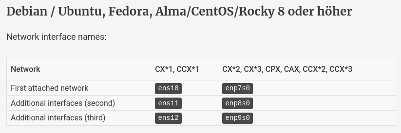

# Uninstalling or Deactivating the Auto-configuration Package

To disable or uninstall automatic configuration for `NAT gateway` configuration, uninstall the `hc-utils` package or deactivate it for the corresponding network interface.

Otherwise there's a risk, that two DHCP clients will compete over the configuration, which will cause side effects or outages.

## Uninstalling the Auto-configuration Package

Do this on the worker server(s) and switch to root user before executing the commands.

- On Debian based distributions (Ubuntu, Debian):
    ```
    apt remove hc-utils
    ```
    
- On RHEL based distributions (Alma, CentOS, Fedora, Rocky):
    ```
    dnf remove hc-utils
    ```

## Deactivating Auto-configuration

You can deactivate the auto-configuration for a network interface by deactivating and masking the `hc-net-ifup` service for the respective interface. 
Please replace interface with the value for your network.
    
    systemctl stop hc-net-ifup@<interface>.service
    systemctl mask hc-net-ifup@<interface>.service

<p align="center">
    
</p>
    
For example, to deactivate the auto-configuration for the first private network interface, stop and mask the `hc-net-ifup` service for the `enp7s0` interface.
    
    systemctl stop hc-net-ifup@enp7s0.service
    systemctl mask hc-net-ifup@enp7s0.service
    
